> **File:** fmha_introduction.md  
> **Author:** AIInfra-lvz
> **Description:** A universal FMHA kernels for CUTLASS 4.x-style   
> **Reference:** [cutlass/examples/blackwell_fmha](https://github.com/cutlass/cutlass)

# Preface
The article aims to provide a detailed explanation of the FMHA kernels in CUTLASS 3.x, with the kernels originating from the CUTLASS examples in blackwell_fmha.

The documentation of CUTLASS shows that the GEMM kernel API consists of five layers, from top to bottom: device, kernel, collective, tiled MMA and copy, and atom. Instead of analyzing each layer separately, we will group the last three layers together for analysis, while also considering the first two layers. Meanwhile, the usage of Cute may be involved in the collective layer. 

Additionally, as this article serves as learning notes for CUTLASS, there may be some unreasonable explanations. You are welcome to critique and correct any mistakes.

# Overview
There are two main sections: the first is about FMHA mathematical theory, and the second is about the program execution pipeline. Introducing these two sections first helps to understand the overall logic of FMHA, which in turn aids in grasping the detailed design.

## Mathematical Theory
The attention module in the transformer architecture has several variants: MHA, GQA, VL-MHA, Gen-MHA, and MHLA. The FMHA being called simply implements these principles using a kernel. The documentation currently only introduces the first two; the others will be improved in the future.

### MHA
MHA is the most basic form of attention, and its theory is described below.

$$
\mathrm{softmax}\left(\frac{Q K^T}{\sqrt{d}}\right) V \\\\
\mathrm{softmax}(x_i) = \frac{2^{\log_2 e \cdot (x_i - \max_j x_j)}}{\sum_k 2^{\log_2 e \cdot (x_k - \max_j x_j)}} 
$$

Obviously, there are three main steps: multiplying matrices Q and K, computing the softmax, and multiplying the result of the first two steps by matrix V. The matrix Q has the same number of heads as matrices K and V.

### GQA
The basic computation of GQA remains unchanged, but a major difference is that matrices K and V have only one head for several heads of matrix Q, so the number of heads in K and V corresponds to the number of groups in Q.

$$
\mathrm{softmax}\left(\frac{Q_i K_{g(i)}^T}{\sqrt{d}}\right) V_{g(i)}
$$

Here, $Q_i$ denotes the $i$-th query, and $K_{g(i)}$ and $V_{g(i)}$ denote the key and value that belong to the same group as $Q_i$. Softmax computation is the same as in MHA.

## Pipeline
As shown in the picture below, the basic computing steps of FMHA are illustrated in a simple flow chart. The complex details will be discussed in the kernel and collective sections.   

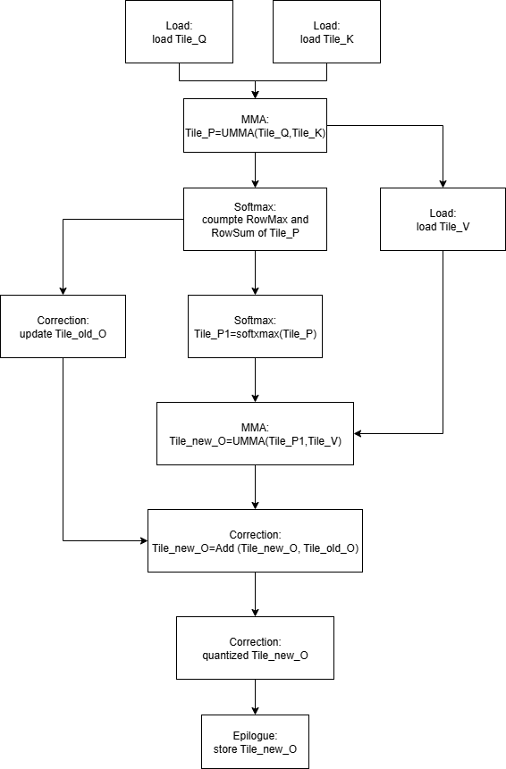    

The flow chart illustrates the flow of each fragmented computation within a block of the CUDA kernel. Each node consists of two parts: stage and detail. The stages include Load, MMA, Softmax, Correction, and Epilogue. These stages represent the organizational structure in the post-kernel layer. The details show the specific events that are carried out in the collective layer. In addition, the side-by-side nodes can be seen as being executed in parallel, and the overlap of multi-stage memory access and computation is not shown.

# Device Layer
Firstly, we will discuss the top layer of CUTLASS: device. The device layer describes the host code responsible for two main tasks: the conversion of outer arguments to inner parameters and the launch methods of CUDA kernels. It serves as the entry point for running the kernel. We will not explain every sentence or line of code, so you may need to read some coding details on your own in *fmha_blackwell_sm120/device/fmha.hpp*.

The template parameter of device layer class is the kernel layer template class, which provides the methods for the argument conversion, shared memory size, grid shape and other global memory size if needed.

## Task 1
The part directly uses the methods of the kernel layer to convert the arguments to parameters, which is done automically in initialize function. The function will also automically check whether the shared memory size is reasonable and attempt to adjust it if necessary.
```
Status initialize(const Arguments& args, void* workspace = nullptr, cudaStream_t stream = nullptr)
```
Note: This function is non-static, which is different from many other functions.

## Task 2
The part needs to overload several run functions, but only one function acutually executes kernel, while the others call it in internally. These run functions mainly cover scenarios such as unchanged arguments, changed arguments and provide advanced method to run kernel when a non-class object is initialized. Therefore, the run function need to be static.
```
// static methods
static Status run(Params& params, cudaStream_t stream = nullptr)
// changed arguments
Status run(const Arguments& args, void* workspace = nullptr, cudaStream_t stream = nullptr) 
// unchanged arguments
Status run(cudaStream_t stream = nullptr) 
```
Additionly, we also need to overload the opertion ().
```
// changed arguments
Status operator()(const Arguments& args, void* workspace = nullptr, cudaStream_t stream = nullptr) 
{
    return run(args, workspace, stream);
}
// unchanged arguments
Status operator()(cudaStream_t stream = nullptr) 
{
    return run(params_, stream);
}
```
The run function provides two methods to lunch the kernel: the generic way and cluster launch.
```
if constexpr(Kernel::ArchTag::kMinComputeCapability >= 90) 
{
    dim3 cluster(cute::size<0>(typename Kernel::ClusterShape{}),
                cute::size<1>(typename Kernel::ClusterShape{}),
                cute::size<2>(typename Kernel::ClusterShape{}));
    void const* kernel = (void const*) device_kernel<Kernel>;
    void* kernel_params[] = {&params};
    launch_result = ClusterLauncher::launch(grid, cluster, block, smem_size, stream, kernel, kernel_params);
}
else 
{
    launch_result = Status::kSuccess;
    device_kernel<Kernel><<<grid, block, smem_size, stream>>>(params);
}
```

## Cluster
Cluster launch is supported in Hopper and Blackwell architectures, and one of its abilities is to provide a multi-broadcast function. Multi-broadcast can broadcast data to different blocks within the same cluster when those blocks need the same tiled data, which can significantly reduce memory access time.
```
// Shape of the threadblocks in a cluster
using ClusterShape = Shape<_4,_2,_1>;
```
Note:
X indicates the number of blocks along the M dimension to broadcast when executing GEMM. Y indicates the number of blocks along the N dimension, and Z indicates the number of blocks along the K
dimension.

# Kernel Layer
There are also two main sections in the kernel layer: pipeline organization and tile scheduler. The computation pipeline for one tile within a block has already been illustrated in the Overview section, so the following pipeline provides more details about the pipelines.

## Pipeline Origanization
Before introducing pipeline organization, we should learn about three important things: first, the Tensor Memory Accelerator (TMA); second, Tensor Memory (TMEM); and third, warp-specialized kernel schedules. These are helpful for us to grasp the pipeline parameters design and register allocation within pipeline organization.

### Tensor Memory Accelerator (TMA)
A [blog](https://research.colfax-intl.com/tutorial-hopper-tma/) is recommended for a detailed understanding of TMA. This section refers to that blog.
TMA is a new feature introduced in the NVIDIA Hopper™ architecture for doing asynchronous memory copy between a GPU’s global memory (GMEM) and the shared memory (SMEM) of its threadblocks (i.e., CTAs). Therefore, it is only useful on architectures with compute capability 90a or higher. Instead of implementing TMA, this section focuses on understanding what TMA is and its usage limitations. The usage of TMA will be demonstrated in the load stage of the collective layer with code examples.    

We divide the TMA section into three main parts: the first covers TMA load, the second covers TMA store, and the third discusses more advanced operations such as TMA store reduce and TMA load multicast. In essence, TMA load copies data from the GPU’s GMEM into a CTA’s SMEM, while TMA store copies data from a CTA’s SMEM to the GPU’s GMEM. We will introduce most of the necessary concepts about TMA. 

#### TMA Load/Store
TMA load copies data from GMEM into SMEM, while TMA store does the opposite. This copy operation is limited in that only one thread is responsible for issuing the operation, as shown in the code snippet below from the file *fmha_blackwell_sm120/collective/sm120_fmha_load_tma_warpspecialized.hpp*.
```
uint32_t lane_predicate = cute::elect_one_sync();       // select only one thread, usually the 0th thread.
if (lane_predicate)
{
    auto tma_barrier = pipeline_q.producer_get_barrier(pipeline_q_producer_state);
    copy(params.tma_load_q.with(*tma_barrier, 0), tQgQ(_, q0_index), tQsQ(_, pipeline_q_producer_state.index()));
}
```
As shown in the corresponding PTX code snippet below from the file *cute/arch/copy_sm90_tma.hpp*.
```
#if defined(CUTE_ARCH_TMA_SM120_ENABLED)
    asm volatile (
      "cp.async.bulk.tensor.2d.shared::cta.global.mbarrier::complete_tx::bytes.L2::cache_hint"
      " [%0], [%1, {%3, %4}], [%2], %5;"
      :
      : "r"(smem_int_ptr), "l"(gmem_int_desc), "r"(smem_int_mbar),
        "r"(crd0), "r"(crd1), "l"(cache_hint)
      : "memory");
#else
    asm volatile (
      "cp.async.bulk.tensor.2d.shared::cluster.global.mbarrier::complete_tx::bytes.L2::cache_hint"
      " [%0], [%1, {%3, %4}], [%2], %5;"
      :
      : "r"(smem_int_ptr), "l"(gmem_int_desc), "r"(smem_int_mbar),
        "r"(crd0), "r"(crd1), "l"(cache_hint)
      : "memory");
#endif
```
However, all the threads within the CTA should wait for the copy operation to complete, as implemented in the PTX code snippet below from the file *cutlass/arch/barrier.h*.
```
  CUTLASS_HOST_DEVICE
  static void wait(ValueType const* smem_ptr, uint32_t phase) {
#if CUDA_BARRIER_ENABLED
    uint32_t smem_addr = cute::cast_smem_ptr_to_uint(smem_ptr);
    cutlass::arch::synclog_emit_cluster_barrier_wait(__LINE__, smem_addr, phase);
    // Arbitrarily large timer value after which try-wait expires and re-tries.
    uint32_t ticks = 0x989680;
    asm volatile(
        "{\n\t"
        ".reg .pred       P1; \n\t"
        "LAB_WAIT: \n\t"
        "mbarrier.try_wait.parity.shared::cta.b64 P1, [%0], %1, %2; \n\t"
        "@P1 bra DONE; \n\t"
        "bra     LAB_WAIT; \n\t"
        "DONE: \n\t"
        "}"
        :
        : "r"(smem_addr), "r"(phase), "r"(ticks));

#elif defined(__CUDA_ARCH__)
    asm volatile ("brkpt;\n" ::);
#endif
  }
```
Actually, instead of using this API directly, we call higher-level instructions such as the `consumer_wait` API and similar functions provided by the pipeline object from the file *cutlass/pipeline/sm_90_pipeline.hpp*.      
In addition, compared to TMA load, TMA store has some differences.
```
if (lane_predicate)
{
    copy(params.tma_store_o, tOsO(_,_,_,_1{}), tOgO(_,_,_,o1_index));
}

tma_store_arrive();

tma_store_wait<0>();  
```
`tma_store_arrive()` commits the TMA store operation (technically, as a cp.async.bulk-group), and `tma_store_wait<Count>()` waits until at most Count of the committed TMA store operations are still pending (e.g., if all should be completed, set Count to 0).   

#### TMA Load Multicast
Multicast refers to a situation where we have a tile in a GMEM tensor that we want to copy to multiple SMEM locations in multiple CTAs. This is typically the case in GEMM kernels (i.e., matrix multiplication), where an input matrix column tile is needed for multiple row tiles or vice versa. In such cases, while TMA load is still perfectly functional — we simply provide the same TMA descriptor to the multiple CTAs that need it — the .multicast operand allows us to guarantee L2-cache hits.
```
uint32_t lane_predicate = cute::elect_one_sync();       // select only one thread, usually the 0th thread.
if (lane_predicate)
{
    auto tma_barrier = pipeline_q.producer_get_barrier(pipeline_q_producer_state);
    copy(params.tma_load_q.with(*tma_barrier, 0), tQgQ(_, q0_index), tQsQ(_, pipeline_q_producer_state.index()));
}
```
If a multicast operation is needed, you can replace the parameter 0 in `params.tma_load_q.with(*tma_barrier, 0)` with a uint16 number as a bitmask. This bitmask specifies which CTAs will participate in the TMA multicast load: each bit set to 1 indicates an active CTA. There can be up to 16 CTAs in a cluster (the maximum non-portable size), and the position of each bit corresponds to the CTA ID in cluster.    
More details about TMA multicast and TMA store reduce are not explained here. They can be found in this [blog](https://research.colfax-intl.com/tutorial-hopper-tma/).

### Tensor Memory (TMEM)
A [blog](https://research.colfax-intl.com/cutlass-tutorial-writing-gemm-kernels-using-tensor-memory-for-nvidia-blackwell-gpus/) and [PTX documentation](https://docs.nvidia.com/cuda/parallel-thread-execution/index.html#tensor-memory-addressing) are recommended for a detailed understanding of TMEM. This section refers to both of them.  

TMEM is introduced by the NVIDIA Blackwell architecture (SM100) and is a dedicated on-chip memory for use by Tensor Cores. Its primary purpose is to replace registers for 5th generation Tensor Core operations by using TMEM instead. The MMA instruction for TMEM is `UMMA`, which differs from the WGMMA instruction in that it supports low-precision data types, including FP4 and FP6, provides increased throughput across all precisions, and can only be launched by one thread in a CTA. Two adjacent CTAs within an SM cluster, called a CTA pair, can work on `UMMA` together across two SMs. Even when using two CTAs, only one thread in one CTA launches `UMMA`.  Obviously, TMEM solves the problem of high register usage when implementing GEMM.  

TMEM is 256KB per SM in size, and is organized 2-dimensionally in 512 columns and 128 rows, or lanes, of 32-bit cells. This inherent 2-D structure is reflected in the 32-bit addresses as well, where bits 31-16 denote the lane ID while 15-0 denote the column. This image from the PTX documentation shows the layout:

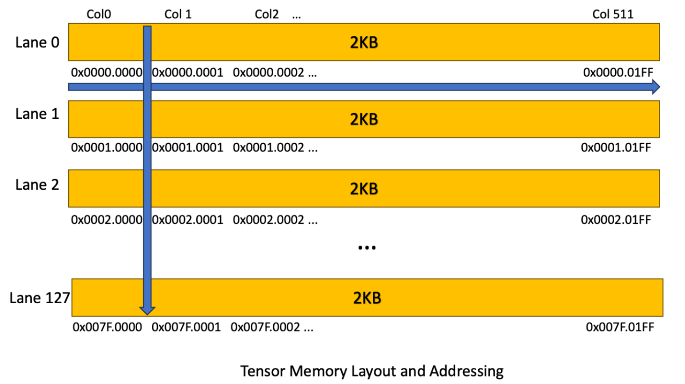

TMEM is allocated dynamically using the tcgen05.alloc instruction. Furthermore, allocation is in units of columns, so in particular every lane of a column is allocated when a column is allocated. The number of columns allocated must be a power of 2 and at least 32. Finally, TMEM must be explicitly deallocated with tcgen05.dealloc. Both tcgen05.alloc and tcgen05.dealloc must be called from a single warp, and the same warp as far as possible both allocate and deallocate. Generally, we use the high-level to allocate or deallocate memory provided by cutlass.
```
// TMEM object
TmemAllocator tmem_allocator;
// allocate TMEM
tmem_allocator.allocate(TmemAllocator::Sm100TmemCapacityColumns, &shared_storage.tmem_base_ptr);
//deallocate TMEM
tmem_allocator.free(shared_storage.tmem_base_ptr, TmemAllocator::Sm100TmemCapacityColumns);
```
Notice that `tmem_allocator.allocate` stores the base 32-bit address of the allocation to a given location in shared memory and we need to select a single fully active warp of the CTA to use `tmem_allocator.allocate` and `tmem_allocator.free`.
```
  CUTE_HOST_DEVICE void
  allocate(int num_columns, uint32_t* dst_ptr) {
  #if defined(CUTE_ARCH_TCGEN05_TMEM_ENABLED)
    uint32_t dst_intptr = cute::cast_smem_ptr_to_uint(dst_ptr);
    asm volatile(
      "tcgen05.alloc.cta_group::1.sync.aligned.shared::cta.b32 [%0], %1;"
      :
      : "r"(dst_intptr), "r"(num_columns));
  #else
    CUTE_INVALID_CONTROL_PATH("Attempting to use TMEM allocation PTX without CUTE_ARCH_TCGEN05_TMEM_ENABLED");
  #endif
  }

  __device__
  void
  free(uint32_t tmem_ptr, int num_columns) {
  #if defined(CUTE_ARCH_TCGEN05_TMEM_ENABLED)
    asm volatile(
      "{\n\t"
      "tcgen05.dealloc.cta_group::1.sync.aligned.b32  %0, %1; \n\t"
      "}"
      :
      : "r"(tmem_ptr), "r"(num_columns));
  #else
    CUTE_INVALID_CONTROL_PATH("Attempting to use TMEM allocation PTX without CUTE_ARCH_TCGEN05_TMEM_ENABLED");
  #endif
  }
```
Typically, data gets into TMEM via UMMA operations, and is explicitly moved out to registers using tcgen05.ld for post-processing. It’s also possible for threads to manually load data into TMEM, either from SMEM through tcgen05.cp or from registers through tcgen05.st. However, TMEM access patterns for explicit load and store are very restricted. Each warp within a warpgroup can only access 32 lanes (with warp 0 associated to lanes 0-31, warp 1 to lanes 32-63, and so forth). 

Finally, besides UMMA operations and these data movement instructions, no other operations access data from TMEM. In other words, all pre-processing must happen before the data is loaded onto TMEM, and all post-processing must happen after the data is retrieved out of TMEM.

#### UMMA
UMMA only use TMEM and its low-level is `tcgen05.mma` operation. From the [table of supported matrix shapes](https://docs.nvidia.com/cuda/parallel-thread-execution/index.html#tcgen05-kind-shapes), we see that MMA instructions are available in shapes 64 x N x 16 with N a multiple of 8 and 128 x N x 16 with N a multiple of 16, where in both cases N is at most 256. (For all data types, K is expected to be 32 bytes wide for dense GEMM.) Note that the largest UMMA atom, 128 x 256 x 16, is twice as large as the largest WGMMA atom. Its accumulator takes up exactly half of TMEM, meaning that several UMMA atoms can be pipelined without sacrificing performance.     

In addition, for executing D = A × B + D, UMMA supports limited matrix multiplication in two situations: (1) both matrices A and B use SMEM, and (2) matrix A uses TMEM while matrix B uses SMEM. In both cases, matrix D must use TMEM. These cases can be described by the instructions `SM100_MMA_F16BF16_SS` and `SM100_MMA_F16BF16_TS`, for example:
```
// both of SMEM
TiledMMA tiled_mma = make_tiled_mma(SM100_MMA_F16BF16_SS<TypeA, TypeB, TypeC,                 
                                                         128, 256,
                                                         UMMA::Major::K, 
                                                         UMMA::Major::K>{});

// A is TMEM, B is SMEM
TiledMMA tiled_mma = make_tiled_mma(SM100_MMA_F16BF16_TS<TypeA, TypeB, TypeC,                 
                                                         128, 256,
                                                         UMMA::Major::K, 
                                                         UMMA::Major::K>{});
```
Notice again that UMMA can be launched by only one thread in a CTA.

#### Copy out of TMEM
Once all the MMAs are done, we need to copy the accumulator results from TMEM to registers. This is done using the PTX tcgen05.ld instruction. CUTLASS abstracts tcgen05.ld as a copy atom, with different variants we saw earlier represented as different copy traits defined in copy atoms found in *cute/atom/copy_traits_sm100.hpp*. For example, the `SM100_TMEM_LOAD_32dp32b1x` atom describes these details: `32dp` indicates the fully active threads in a warp, `32b` denotes 32 bits for each element, and `1x` indicates the repetition count. More instruction types can be found in the file *cute/arch/copy_sm100.hpp*. The code snippet below shows the specific definition of the `SM100_TMEM_LOAD_32dp32b1x` atom as an example.
```
// 32 data path lanes, 32-bit pattern, repeated 1 times
struct SM100_TMEM_LOAD_32dp32b1x
{
  using SRegisters = uint32_t[1];
  using DRegisters = uint32_t[1];
 
  CUTE_HOST_DEVICE static void
  copy(uint32_t const& src_addr,
       uint32_t& dst0)
  {
#if defined(CUTE_ARCH_TCGEN05_TMEM_ENABLED)
    asm volatile ("tcgen05.ld.sync.aligned.32x32b.x1.b32"
                    "{%0},"
                    "[%1];\n"
    :  "=r"(dst0)
    :  "r"(src_addr));
#else
    CUTE_INVALID_CONTROL_PATH("Trying to use TMEM_LOAD without CUTE_ARCH_TCGEN05_TMEM_ENABLED.");
#endif
  }
};
```
Generally, we use a specialized function, `make_tmem_copy`, to deduce a TV-layout from the copy atom and TMEM tensor and create the TiledCopy. 
```
// Create the tiled copy operation for the accumulator (TMEM -> RMEM)
TiledCopy tiled_t2r_copy = make_tmem_copy(SM100_TMEM_LOAD_32dp32b1x{}, tCtAcc);
// Get the copy operation for the accumulator assigned to the current thread
ThrCopy   thr_t2r_copy   = tiled_t2r_copy.get_slice(threadIdx.x);
```
One important thing to know about `make_tmem_copy` function is that it is hardcoded to use 4 warps, or 1 warpgroup. As shown in PTX code snippet from the *file cute/atom/copy_traits_sm100.hpp*.
```
template <class CopyOp, class CopyT,
          class TEngine, class TLayout>
CUTE_HOST_DEVICE constexpr
auto
make_tmem_copy(Copy_Atom<CopyOp,CopyT> const& atom,
               Tensor<TEngine,TLayout> const& tmem)
{
  static_assert(is_tmem<TEngine>::value, "Expected TMEM tensor.");
  using T      = typename TEngine::value_type;
  using Traits = typename Copy_Atom<CopyOp, CopyT>::Traits;
  static_assert(sizeof_bits_v<CopyT> == sizeof_bits_v<T>,
                "Expected a CopyAtom with the same type-width as the Tensor.");

  // atom thr idx -> tmem addr    4warps where each warp points to the same position within it's own subpartition
  auto atom_t_layout = Layout<Shape<_32,_4>, Stride<_0, decltype(Int<32>{} * TMEM::DP<T>{})>>{};
  // atom val idx -> tmem addr    Cast the CopyOp's value ids to the proper data width
  auto atom_v_layout = coalesce(upcast<sizeof_bits<T>::value>(typename Traits::ValID{}));

  return make_cotiled_copy(atom, make_layout(atom_t_layout, atom_v_layout), tmem.layout());
}
``` 
The `atom_t_layout` in line 312 shows that its shape is `Shape<_32,_4>`, which denotes 32 threads in a warp and 4 warps in a warpgroup.  

As mentioned in the earlier section, certain regions of TMEM are only accessible by a corresponding warp in a warpgroup, based on the warp index mod 4. This [diagram from the PTX manual](https://docs.nvidia.com/cuda/parallel-thread-execution/index.html#tensorcore-5th-generation-instructions) shows how the data is assigned to warps, and you can find more details there if needed.    

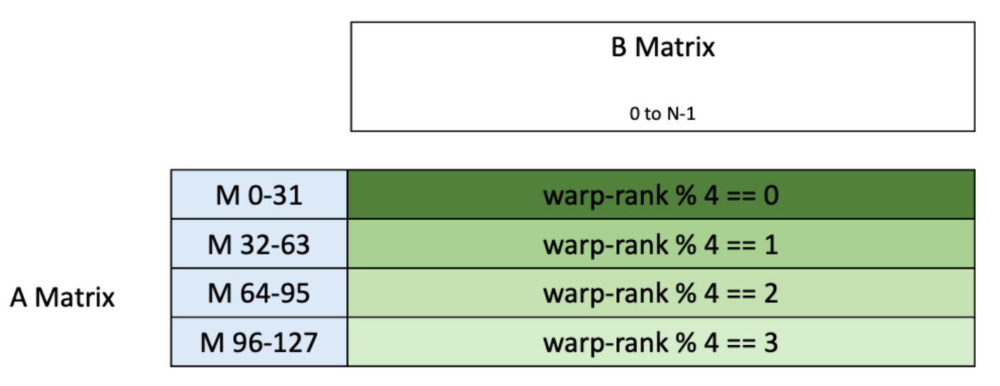

The pictures below show the TMEM addresses that this maps to.   

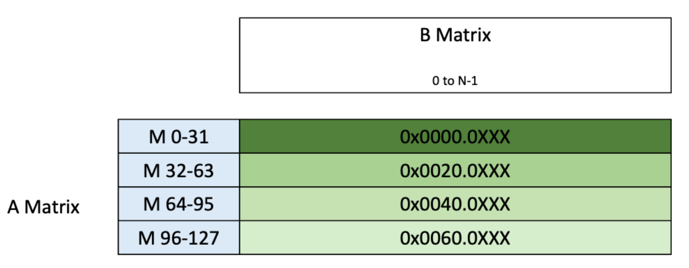

### Warp-Specialized Kernel Schedules
In a block of FMHA, a total of 16 warps are each assigned a specific role, such as Load, MMA, Softmax0, Softmax1, Correction, Epilogue, or Empty. Except for Empty, which is a reserved warp for future use, the other warps carry out specific tasks.
```
struct Sm120FmhaCtxKernelWarpspecializedSchedule
  {

    enum class WarpRole
    {
      Softmax0,
      Softmax1,
      Correction,
      MMA,
      Load,
      Epilogue,
      Empty
    };

    static constexpr WarpRole warp_idx_to_WarpRole(int warp_idx)
    {
      int wg_idx = warp_idx / 4;                        // warp_idx
      if (wg_idx == 0) return WarpRole::Softmax0;       //   0 -  3
      if (wg_idx == 1) return WarpRole::Softmax1;       //   4 -  7
      if (wg_idx == 2) return WarpRole::Correction;     //   8 - 11
      if (warp_idx == 12) return WarpRole::MMA;         //       12
      if (warp_idx == 13) return WarpRole::Load;        //       13
      if (warp_idx == 14) return WarpRole::Epilogue;    //       14
      return WarpRole::Empty;                           //       15
    }

    static const int NumWarpsSoftmax = 4;
    static const int NumWarpsCorrection = 4;
    static const int NumWarpsEpilogue = 1;
    static const int NumWarpsLoad = 1;

    static const bool kDebugUsingPrintf = false;
    static const int NumRegsSoftmax = 192;
    static const int NumRegsCorrection = 96 - (kDebugUsingPrintf ? 16 : 0);
    static const int NumRegsOther = 32 + (kDebugUsingPrintf ? 16 : 0);
    static const int NumRegsEmpty = 24;

    static const int NumWarps = 16;
  };
```
`WarpRole` is not discussed further here; please refer to the Overview Pipeline section for more information. We will focus on explaining the number of warps assigned to each warp role and their corresponding register counts. 

#### Warp Assignment
As the code snippet shows, the MMA, Load, and Epilogue operations each use only one warp. This is because these three operations perform TMA Load, UMMA, and TMA Store, as described in the previous chapter. They are synchronized and must be launched by a single thread in the CTA, so assigning one warp is sufficient. In contrast, the Softmax and Correction operations are post-processing steps for TMEM. It is known that any post-processing operation on TMEM requires 4 warps, or a warp group, which is hardcoded in the `make_tmem_copy` instruction.

#### Register Assignment
Before discussing register assignment, it is helpful to understand the [Miscellaneous Instructions: setmaxnreg](https://docs.nvidia.com/cuda/parallel-thread-execution/index.html?highlight=setmaxnreg%2520dec#miscellaneous-instructions-setmaxnreg). The detailed usage in the high-level CUTLASS API is shown below:
```
// allocate resgisters
cutlass::arch::warpgroup_reg_alloc<RegCount>();
// deallocate registers
cutlass::arch::warpgroup_reg_dealloc<RegCount>();
```
The corresponding PTX instructions are as follows:
```
template<uint32_t RegCount>
CUTLASS_DEVICE
void warpgroup_reg_alloc(){
#if CUDA_CTA_RECONFIG_ACTIVATED
  asm volatile( "setmaxnreg.inc.sync.aligned.u32 %0;\n" : : "n"(RegCount) );
#endif
}

template<uint32_t RegCount>
CUTLASS_DEVICE
void warpgroup_reg_dealloc(){
#if CUDA_CTA_RECONFIG_ACTIVATED
  asm volatile( "setmaxnreg.dec.sync.aligned.u32 %0;\n" : : "n"(RegCount) );
#endif
}
```
The following requirements are from the [Miscellaneous Instructions: setmaxnreg](https://docs.nvidia.com/cuda/parallel-thread-execution/index.html?highlight=setmaxnreg%2520dec#miscellaneous-instructions-setmaxnreg):   
(1) The `.dec` qualifier releases extra registers, reducing the absolute per-thread maximum register count from its current value to `RegCount`. The `.inc` qualifier requests additional registers, increasing the absolute per-thread maximum register count from its current value to `RegCount`.    
(2) A pool of available registers is maintained per-CTA. Register adjustments requested by `setmaxnreg` instructions are handled by supplying extra registers from this pool to the requesting warp, or by releasing extra registers from the requesting warp back to this pool.    
(3) The `setmaxnreg.inc` instruction blocks execution until enough registers are available in the CTA’s register pool. After `setmaxnreg.inc` obtains new registers from the CTA pool, the initial contents of these registers are undefined and must be initialized before use.    
(4) The operand `RegCount` is an integer constant. Its value must be in the range 24 to 256 (inclusive) and must be a multiple of 8.    
(5) When the `.dec` qualifier is specified, the maximum number of per-thread registers owned by the warp prior to executing the `setmaxnreg` instruction must be greater than or equal to `RegCount`; otherwise, the behavior is undefined. When the `.inc` qualifier is specified, the maximum number of per-thread registers owned by the warp prior to executing the `setmaxnreg` instruction must be less than or equal to `RegCount`; otherwise, the behavior is undefined.    
(6) The mandatory `.sync` qualifier indicates that the `setmaxnreg` instruction causes the executing thread to wait until all threads in the warp execute the same `setmaxnreg` instruction before resuming execution.    
(7) The mandatory `.aligned` qualifier indicates that all threads in the warpgroup must execute the same `setmaxnreg` instruction. In conditionally executed code, the `setmaxnreg` instruction should only be used if it is known that all threads in the warpgroup evaluate the condition identically; otherwise, the behavior is undefined.    

Except for additional debug printf registers, `NumRegsOther` refers to the MMA, Load, and Epilogue operations. These operations mainly use SMEM and TMEM, so they require only a few registers to store several variables, rather than large tile tensor data. Requirements (4), (6), and (7) above explain why `NumRegsEmpty` is set to 24, and why MMA, Load, Epilogue, and Empty all belong to the same warpgroup and maintain a maximum value less than 255 per thread in the CTA.    

Softmax and Correction require more registers because both are post-processing steps for TMEM. They need to copy data from TMEM to registers for additional computation. The specific register values will be demonstrated in the Collective Layer Softmax and Correction section.  

Additionally, as an additional point, we use the high-level API `warpgroup_reg_set` to set the number of registers per thread. The API details are as follows:
```
template<uint32_t RegCount>
CUTLASS_DEVICE void 
warpgroup_reg_set()
{
  if constexpr (RegCount < 128)
  {
    cutlass::arch::warpgroup_reg_dealloc<RegCount>();
  }
  else
  {
    cutlass::arch::warpgroup_reg_alloc<RegCount>();
  }
}
```
As the code snippet above shows, the constant value 128 is used to determine whether to allocate or deallocate registers. Why 128? Consider that the maximum number of registers per-CTA is 65536, and there are 16 warps in a CTA. Therefore, the average number of registers per thread is 128.  

### Pipeline Creation
From the above specifications, it is easy to understand why different warp roles are defined and how to set the corresponding parameters. Now, let's return to the Kernel Layer to see what needs to be done. In fact, the file *fmha_blackwell_sm120/kernel/sm120_fmha_fwd_kernel_tma_warpsspecialized.hpp* clearly shows that the main task of the kernel layer within FMHA is to create a pipeline variable and establish a producer-consumer mechanism between different warp roles. For example:
```
// between LoadQ and UMMA
typename CollectiveMainloop::PipelineQ::Params pipeline_load_q_params;
if (role == KernelSchedule::WarpRole::Load)
{
  pipeline_load_q_params.role = CollectiveMainloop::PipelineQ::ThreadCategory::Producer;
}
if (role == KernelSchedule::WarpRole::MMA)
{
  pipeline_load_q_params.role = CollectiveMainloop::PipelineQ::ThreadCategory::Consumer;
}
pipeline_load_q_params.is_leader         = lane_predicate && (role == KernelSchedule::WarpRole::Load);
pipeline_load_q_params.transaction_bytes = CollectiveMainloop::TransactionBytesLoadQ;
typename CollectiveMainloop::PipelineQ pipeline_load_q(
  shared_storage.pipelines.load_q,
  pipeline_load_q_params,
  ClusterShape{},  cute::true_type{}, /*mask calc*/cute::false_type{}
);
```
```
// between Softmax and Correction
typename CollectiveMainloop::PipelineC::Params pipeline_s0_corr_params;
if (role == KernelSchedule::WarpRole::Softmax0)
{
  pipeline_s0_corr_params.role = CollectiveMainloop::PipelineC::ThreadCategory::Producer;
}
if (role == KernelSchedule::WarpRole::Correction)
{
  pipeline_s0_corr_params.role = CollectiveMainloop::PipelineC::ThreadCategory::Consumer;
}
pipeline_s0_corr_params.producer_arv_count = NumWarpsSoftmax * cutlass::NumThreadsPerWarp;
pipeline_s0_corr_params.consumer_arv_count = NumWarpsCorrection * cutlass::NumThreadsPerWarp;
typename CollectiveMainloop::PipelineC pipeline_s0_corr(
  shared_storage.pipelines.s0_corr,
  pipeline_s0_corr_params,
  /*barrier init*/ cute::true_type{}
);
```
This example illustrates how to establish a producer-consumer relationship. Note that the pipeline parameters in the two code snippets are slightly different. The essential reasons for these differences, which are related to TMA and TMEM, have already been explained in previous sections, so a more detailed description is omitted here.    

Another interesting aspect is how synchronization between the producer and consumer is achieved. Let's first look at the following code snippet:
```
typename CollectiveMainloop::PipelineQ::PipelineState pipeline_load_q_consumer_state;
typename CollectiveMainloop::PipelineQ::PipelineState pipeline_load_q_producer_state = cutlass::make_producer_start_state<typename CollectiveMainloop::PipelineQ>();
```
The deatil code snippet of `PipelineState` in file *cutlass/pipeline/sm90_pipeline.hpp*:
```
template<uint32_t Stages_>
struct PipelineState {

  static constexpr uint32_t Stages = Stages_;

  int index_ = 0;
  uint32_t phase_ = 0;
  uint32_t count_ = 0;

  CUTLASS_DEVICE
  PipelineState(): index_{}, phase_{}, count_{} {}

  CUTLASS_DEVICE
  PipelineState(int index, uint32_t phase, uint32_t count)
    : index_(index)
    , phase_(phase)
    , count_(count) {}

  CUTLASS_DEVICE
  void operator++() {
    if constexpr (Stages > 0) {
      ++index_;
      ++count_;
      if (index_ == Stages) {
        index_ = 0;
        phase_ ^= 1;
      }
    }
  }
}
```
`Stages` represents the number of memory buffers used for pipelining, determining the degree of overlap between memory access and computation. This is analogous to double buffering or ping-pong methods commonly used in single-precision matrix multiplication with CUDA cores. `index_` is the array subscript indicating the current buffer, and `phase_` indicates whether the buffer is available for use. To better illustrate the roles of `index_` and `phase_`, consider the following code snippet from *cutlass/pipeline/sm100_pipeline.hpp* and *cutlass/pipeline/sm90_pipeline.hpp*:
```
// cutlass/pipeline/sm90_pipeline.hpp
template <int Stages_>
class PipelineTmaAsync {
public:
  using FullBarrier = cutlass::arch::ClusterTransactionBarrier;
  using EmptyBarrier = cutlass::arch::ClusterBarrier;
  using ProducerBarrierType = FullBarrier::ValueType;
  using ConsumerBarrierType = EmptyBarrier::ValueType;
  static constexpr uint32_t Stages = Stages_;
  using PipelineState = cutlass::PipelineState<Stages>;

  struct SharedStorage {
    FullBarrier full_barrier_[Stages];
    EmptyBarrier empty_barrier_[Stages];
  };
  ...
}
```
```
// cutlass/pipeline/sm100_pipeline.hpp
template <
  int Stages_,
  class ClusterShape = Shape<int,int,_1>,
  class AtomThrShape_MNK_ = Shape<_1,_1,_1>
>
class PipelineTmaUmmaAsync {
public:
  static constexpr uint32_t Stages = Stages_;
  using AtomThrShape_MNK = AtomThrShape_MNK_;
private:
  using Impl = PipelineTmaAsync<Stages>;
public:
  using FullBarrier  = typename Impl::FullBarrier;
  using EmptyBarrier = typename Impl::EmptyBarrier;
  ...
}
```
Obviously, both `full_barrier_ptr_` and `empty_barrier_ptr_` are arrays in shared memory (SMEM) and work together to maintain synchronization. `empty_barrier_ptr_` records the status of the producer buffer, while `full_barrier_ptr_` records the status of the consumer buffer. When `producer_acquire` is called, it updates the buffer status in the `empty_barrier_ptr_` array at the position specified by the `index_` and `phase_` fields of `PipelineState`. Similarly, the `full_barrier_ptr_` array is updated for the consumer side. For more details, refer to *cutlass/pipeline/sm90_pipeline.hpp*.

## Tile Scheduler
This section will illustrate two tile scheduling strategies: persistent and non-persistent tile schedulers.

### No-Persistent Tile scheduler
In a non-persistent tile scheduler, each CTA completes only one tile of computation. For example, `IndividualTileScheduler` is non-persistent in FMHA because its grid shape is set as shown in the following code snippet.
```
template<class ProblemSize, class ClusterShape, class TileShape>
static Params to_underlying_arguments(
  const ProblemSize& problem_size, KernelHardwareInfo hw_info,
  const ClusterShape& cluster_shape, const TileShape& tile_shape)
{
    dim3 grid(round_up(ceil_div(size<0>(problem_size), size<0>(tile_shape)), size<0>(cluster_shape)), 
        size<3,0>(problem_size), 
        size<3,1>(problem_size));
    return Params{ grid };
}
```

### Persistent Tile scheduler
In contrast, the persistent tile scheduler allows each CTA to process multiple work units (tiles), with each work unit's offset being `gridDim.x`. The grid shape is set to the number of SMs if the number of work units exceeds the number of SMs.
```
static dim3 get_grid_shape(Params const& params)
{
    dim3 grid(std::min(params.num_blocks, params.hw_info.sm_count), 1, 1);
    return grid;
}
```
In this way, it can mitigate both load imbalance and the **wave quantization** problem.   
**Wave quantization**   
When the number of work units exceeds the number of available SMs, the work units are processed in multiple waves. One wave is defined as each available SM completing a single work unit. **Wave quantization** occurs when the number of work units is not evenly divisible by the number of available SMs. For example, consider a case with 10 work units and 4 SMs. The work unit execution timeline would look like: 

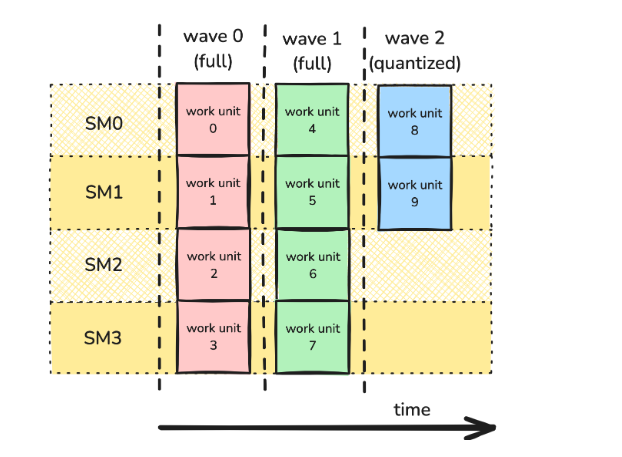   

In this case, the first two waves are full waves, with every SM being utilized. However, the final wave is a partial wave, where only half of the SMs are occupied.    

However, the persistent tile scheduler can maintain high SM utilization by reducing the idle time that occurs while SMs wait to be assigned new CTAs, thereby mitigating the wave quantization problem. More information about **wave quantization** and additional performance guidance can be found in the blog post [CUTLASS Tutorial: Persistent Kernels and Stream-K](https://research.colfax-intl.com/cutlass-tutorial-persistent-kernels-and-stream-k/) and the [NVIDIA Deep Learning Performance Guide](https://docs.nvidia.com/deeplearning/performance/dl-performance-matrix-multiplication/index.html#math-mem).

# Collective Layer
Welcome to the last section. In this section, we will focus on practical code implementation, including how to use TMA, TMEM, UMMA, and more, based on specific code examples. However, before discussing the collective layer, we should learn about a core library named CUTE, which solves the complex problem of mapping the logical positions of loading, storing, and computing data to the actual physical addresses and vice versa. After that, we will begin to discuss the code details of how to implement the collective layer.

## CUTE
This section is organized into four main parts: the first covers **Tensor**, the second covers **Copy Abstraction**, the third covers **MMA Abstraction**, and the fourth covers **Swizzle**. These parts correspond to data types, data transfer, data computation, and high-performance shared memory data layout, respectively.

### Tensor
This data type was introduced in CUTLASS 3.0. We will refer to its structure and related algebraic operations. Since there is an abundance of content, we will not cover every detail, but instead focus on the most important and commonly used aspects. For more information, you can refer to the [documentation](https://docs.nvidia.com/cutlass/media/docs/cpp/cute/index.html).

#### Tensor Structure
A `Tensor` consists of an `Engine` and a `Layout`, which together abstract away the details of how the array’s elements are organized and stored. In this way, tensors of different shapes can be represented, while sharing a common memory address. 

**Engine**    
The `Engine`, which represents the storage, includes information such as the memory address, data type, and other details essential for physical memory access. According to the official documentation, the `Engine` concept is a wrapper for an iterator or an array of data. It uses a simplified interface similar to `std::array` to provide iterator functionality.
```
using iterator     =  // The iterator type
using value_type   =  // The iterator value-type
using reference    =  // The iterator reference-type
iterator begin()      // The iterator
```
In general, users do not need to construct `Engine` on their own. When a Tensor is constructed, the appropriate engine – often `ArrayEngine<T,N>`, `ViewEngine<Iter>`, or `ConstViewEngine<Iter>` – will be constructed.   

**Layout**   
The `Layout` defines the data organization, described by the shape and stride of a multidimensional array, as shown below. It is worth mentioning that the essence of a Layout is a function that maps a multi-dimensional logical memory address to a one-dimensional address. This mapping function is reversible, meaning it has a right inverse, while the `Layout` itself is referred to as the left inverse.
```
cute::Layout<
    cute::tuple<cute::tuple<cute::C<128>, cute::C<16>>, cute::_1, cute::tuple<cute::_4, cute::_2>, cute::_2>,           // shape
    cute::tuple<cute::tuple<cute::_64, cute::_1>, cute::_0, cute::tuple<cute::C<16>, cute::C<8192>>, cute::_16384>      // stride
    >
```
And here are some examples of creating a Layout from the Nvidia CUTE documentation. More examples can be found on this [webpage](https://docs.nvidia.com/cutlass/media/docs/cpp/cute/01_layout.html).
```
Layout s8 = make_layout(Int<8>{});
Layout d8 = make_layout(8);

Layout s2xd4_a = make_layout(make_shape (Int< 2>{},4),
                             make_stride(Int<12>{},Int<1>{}));
Layout s2xd4_col = make_layout(make_shape(Int<2>{},4),
                               LayoutLeft{});
Layout s2xd4_row = make_layout(make_shape(Int<2>{},4),
                               LayoutRight{});

Layout s2xh4 = make_layout(make_shape (2,make_shape (2,2)),
                           make_stride(4,make_stride(2,1)));
```
The results of the above examples are as follows:
```
s8        :  _8:_1
d8        :  8:_1

s2xd4_a   :  (_2,4):(_12,_1)
s2xd4_col :  (_2,4):(_1,_2)
s2xd4_row :  (_2,4):(4,_1)

s2xh4     :  (2,(2,2)):(4,(2,1))
```
After learning how to create a `Layout`, we will introduce some common layout manipulation techniques that are widely used throughout CUTE. The following examples are also taken from the official documentation.    
**Sublayouts**    
`layout<I...>`
```
Layout a   = Layout<Shape<_4,Shape<_3,_6>>>{}; // (4,(3,6)):(1,(4,12))
Layout a0  = layout<0>(a);                     // 4:1
Layout a1  = layout<1>(a);                     // (3,6):(4,12)
Layout a10 = layout<1,0>(a);                   // 3:4
Layout a11 = layout<1,1>(a);                   // 6:12
```
`select<I...>`
```
Layout a   = Layout<Shape<_2,_3,_5,_7>>{};     // (2,3,5,7):(1,2,6,30)
Layout a13 = select<1,3>(a);                   // (3,7):(2,30)
Layout a01 = select<0,1,3>(a);                 // (2,3,7):(1,2,30)
Layout a2  = select<2>(a);                     // (5):(6)
```
`take<ModeBegin, ModeEnd>`
```
Layout a   = Layout<Shape<_2,_3,_5,_7>>{};     // (2,3,5,7):(1,2,6,30)
Layout a13 = take<1,3>(a);                     // (3,5):(2,6)
Layout a14 = take<1,4>(a);                     // (3,5,7):(2,6,30)
// take<1,1> not allowed. Empty layouts not allowed.
```
**Concatenation**   
By `make_layout`
```
Layout a = Layout<_3,_1>{};                     // 3:1
Layout b = Layout<_4,_3>{};                     // 4:3
Layout row = make_layout(a, b);                 // (3,4):(1,3)
Layout col = make_layout(b, a);                 // (4,3):(3,1)
Layout q   = make_layout(row, col);             // ((3,4),(4,3)):((1,3),(3,1))
Layout aa  = make_layout(a);                    // (3):(1)
Layout aaa = make_layout(aa);                   // ((3)):((1))
Layout d   = make_layout(a, make_layout(a), a); // (3,(3),3):(1,(1),1)
```
or `append`, `prepend`, `replace`.
```
Layout a = Layout<_3,_1>{};                     // 3:1
Layout b = Layout<_4,_3>{};                     // 4:3
Layout ab = append(a, b);                       // (3,4):(1,3)
Layout ba = prepend(a, b);                      // (4,3):(3,1)
Layout c  = append(ab, ab);                     // (3,4,(3,4)):(1,3,(1,3))
Layout d  = replace<2>(c, b);                   // (3,4,4):(1,3,3)
```
**Grouping and flattening**   
`group<ModeBegin, ModeEnd>`
```
Layout a = Layout<Shape<_2,_3,_5,_7>>{};  // (_2,_3,_5,_7):(_1,_2,_6,_30)
Layout b = group<0,2>(a);                 // ((_2,_3),_5,_7):((_1,_2),_6,_30)
Layout c = group<1,3>(b);                 // ((_2,_3),(_5,_7)):((_1,_2),(_6,_30))
```
`flatten`
```
Layout f = flatten(b);                    // (_2,_3,_5,_7):(_1,_2,_6,_30)
Layout e = flatten(c);                    // (_2,_3,_5,_7):(_1,_2,_6,_30)
```
`Slice`
```
// ((_3,2),(2,_5,_2)):((4,1),(_2,13,100))
Tensor A = make_tensor(ptr, make_shape (make_shape (Int<3>{},2), make_shape (       2,Int<5>{},Int<2>{})),
                            make_stride(make_stride(       4,1), make_stride(Int<2>{},      13,     100)));

// ((2,_5,_2)):((_2,13,100))
Tensor B = A(2,_);

// ((_3,_2)):((4,1))
Tensor C = A(_,5);

// (_3,2):(4,1)
Tensor D = A(make_coord(_,_),5);

// (_3,_5):(4,13)
Tensor E = A(make_coord(_,1),make_coord(0,_,1));

// (2,2,_2):(1,_2,100)
Tensor F = A(make_coord(2,_),make_coord(_,3,_));
```
The results are shown in the picture below, taken from the [CUTE documentation](https://docs.nvidia.com/cutlass/media/docs/cpp/cute/03_tensor.html)   

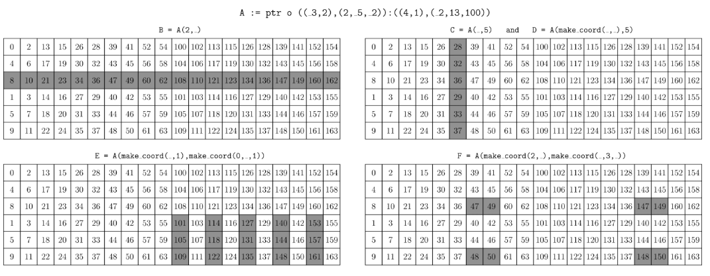    

These are the main layout manipulation techniques. Such manipulation techniques are also well-suited to `Tensor` objects, as operating on a tensor fundamentally means operating on its layout.   

After demonstrating the composition of the Tensor structure, we will return to the `Tensor` itself to discuss its creation and other operations. There are also fundamental operations, such as `size`, `rank`, `depth`, and more，which will not be discussed here. For additional details, please refer to the [documention](https://docs.nvidia.com/cutlass/media/docs/cpp/cute/03_tensor.html).

**Tensor Creation**   
There are two types of tensors: non-owning `Tensor` and owning `Tensor`. The fundamental difference between them is whether the `Tensor Engine` owns its own physical memory. A non-owning `Tensor` is typically used to describe an alternative layout for existing physical memory, and can be created as follows:
```
float* A = ...;

// Untagged pointers
Tensor tensor_8   = make_tensor(A, make_layout(Int<8>{}));  // Construct with Layout
Tensor tensor_8s  = make_tensor(A, Int<8>{});               // Construct with Shape
Tensor tensor_8d2 = make_tensor(A, 8, 2);                   // Construct with Shape and Stride

// Global memory (static or dynamic layouts)
Tensor gmem_8s     = make_tensor(make_gmem_ptr(A), Int<8>{});
Tensor gmem_8d     = make_tensor(make_gmem_ptr(A), 8);
Tensor gmem_8sx16d = make_tensor(make_gmem_ptr(A), make_shape(Int<8>{},16));
Tensor gmem_8dx16s = make_tensor(make_gmem_ptr(A), make_shape (      8  ,Int<16>{}),
                                                   make_stride(Int<16>{},Int< 1>{}));

// Shared memory (static or dynamic layouts)
Layout smem_layout = make_layout(make_shape(Int<4>{},Int<8>{}));
__shared__ float smem[decltype(cosize(smem_layout))::value];   // (static-only allocation)
Tensor smem_4x8_col = make_tensor(make_smem_ptr(smem), smem_layout);
Tensor smem_4x8_row = make_tensor(make_smem_ptr(smem), shape(smem_layout), LayoutRight{});
```
```
tensor_8     : ptr[32b](0x7f42efc00000) o _8:_1
tensor_8s    : ptr[32b](0x7f42efc00000) o _8:_1
tensor_8d2   : ptr[32b](0x7f42efc00000) o 8:2
gmem_8s      : gmem_ptr[32b](0x7f42efc00000) o _8:_1
gmem_8d      : gmem_ptr[32b](0x7f42efc00000) o 8:_1
gmem_8sx16d  : gmem_ptr[32b](0x7f42efc00000) o (_8,16):(_1,_8)
gmem_8dx16s  : gmem_ptr[32b](0x7f42efc00000) o (8,_16):(_16,_1)
smem_4x8_col : smem_ptr[32b](0x7f4316000000) o (_4,_8):(_1,_4)
smem_4x8_row : smem_ptr[32b](0x7f4316000000) o (_4,_8):(_8,_1)
```
The examples of creating an owning Tensor are shown below:
```
// Register memory (static layouts only)
Tensor rmem_4x8_col = make_tensor<float>(Shape<_4,_8>{});
Tensor rmem_4x8_row = make_tensor<float>(Shape<_4,_8>{},
                                         LayoutRight{});
Tensor rmem_4x8_pad = make_tensor<float>(Shape <_4, _8>{},
                                         Stride<_32,_2>{});
Tensor rmem_4x8_like = make_tensor_like(rmem_4x8_pad);
```
```
rmem_4x8_col  : ptr[32b](0x7fff48929460) o (_4,_8):(_1,_4)
rmem_4x8_row  : ptr[32b](0x7fff489294e0) o (_4,_8):(_8,_1)
rmem_4x8_pad  : ptr[32b](0x7fff489295e0) o (_4,_8):(_32,_2)
rmem_4x8_like : ptr[32b](0x7fff48929560) o (_4,_8):(_8,_1)
``` 
In general, when creating an owning `Tensor`, `make_tensor` or `make_tensor_like` will allocate a contiguous memory array internally.

#### Algebraic Operations
The called algebraic operations actually is an algebra of `Layout`, the `Tensor` don't exist algebraic operations. There are three fundamental and core operations: `coalesce`, `composition`and `complement`. We will not extend to discuss them. On the one hand, they are detailly demenstrated by the [office documentation](https://docs.nvidia.com/cutlass/media/docs/cpp/cute/02_layout_algebra.html). On the another hand, it is sorry that the auther don't explain them. Specially. we should mention that `composition` is extremly helpful when two different layout `Tensor` using a common physical memory. It means that many different operations, likes `MMA` or `Copy`, which require different layout `Tensor`, also are supported.

The so-called algebraic operations are actually operations on the `Layout`; the `Tensor` itself does not own algebraic operations. There are three fundamental operations: `coalesce`, `composition`, and `complement`. We will not discuss them in detail here. On one hand, they are thoroughly demonstrated in the [official documentation](https://docs.nvidia.com/cutlass/media/docs/cpp/cute/02_layout_algebra.html). On the other hand, the author is unsure how to further explain these operations. In particular, it is worth mentioning that `composition` is extremely helpful when two tensors with different layouts share the same physical memory. For instance, when we need to use the same data to perform different operations that require different layouts from the current `Tensor`, we can create a new `Layout` and compose it with the current `Tensor`. This allows us to obtain a new layout `Tensor` without allocating additional memory. In addition, we can easily switch between different layouts as needed.
```
// for tensor
typename CollectiveMmaQK::TiledMma mma_qk;

Tensor tScS = mma_qk.get_slice(0).partition_C(cS);
Tensor tStS = partition_fragment_C(mma_qk, select<0,1>(TileShapeQK{}));

Tensor tStS_v = tStS.compose(make_layout(make_shape(_128{}, _2{})));
Tensor tScS_v = tScS.compose(make_layout(make_shape(_128{}, _2{})));
```
```
// for layout
template<class Layout, class Stages = _1>
CUTE_DEVICE 
constexpr auto 
unstageSmemLayout(Layout const& layout, Stages stages = {}) 
{
  return composition(layout, prepend<decltype(rank(layout))::value>(make_layout(stages), _));
}
```
Note that the use of `composition` has certain requirements, which are explained in detail in the official documentation.   

Next, let's look at the operations: product and divide. These are also `Layout` operations, just like those discussed above. We will briefly discuss them here, as the [official documentation](https://docs.nvidia.com/cutlass/media/docs/cpp/cute/02_layout_algebra.html) provides detailed examples.
    
**Product**   
The product of a `Layout` is conceptually similar to ordinary multiplication of real numbers, representing repeated instances of a variable. Informally, there are two types of product operations: 1-D and 2-D. The 1-D operations include `logical_product`, `zipped_product`, `tiled_product`, and `flat_product`. The 2-D operations involve `blocked_product` and `raked_product`. If you are familiar with the official CUTE documentation, you may notice that this classification is not strictly accurate, but it is practical and useful for understanding. The official documentation explains `blocked_product` and `raked_product` in detail, but the author is currently not familiar with them, so they will not be discussed further here. Next, we will demonstrate the essence of the 1-D operations using `logical_product` as an example. The definition of `logical_product` is shown below.
```
template <class LShape, class LStride,
          class TShape, class TStride>
auto logical_product(Layout<LShape,LStride> const& layout,
                     Layout<TShape,TStride> const& tiler)
{
  return make_layout(layout, composition(complement(layout, size(layout)*cosize(tiler)), tiler));
}
```

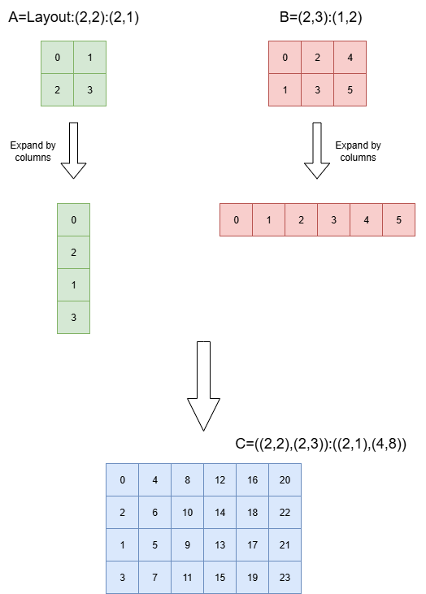

The above figure demonstrates that `size(B)` is the number of repetitions for `Tensor A`. In fact, it can also be viewed as a product between `A = (2,2):(4,1)` and `B = 6:1`. This is because `Tensor B` can be considered as the complement of `Tensor A`, which requires  the `stride` to be monotonically increasing.

The following lists the result formats of all common operations:  
```
Layout Shape : (M, N, L, ...)
Tiler Shape  : <TileM, TileN>

logical_product : ((M,TileM), (N,TileN), L, ...)
zipped_product  : ((M,N), (TileM,TileN,L,...))
tiled_product   : ((M,N), TileM, TileN, L, ...)
flat_product    : (M, N, TileM, TileN, L, ...)
```

**Division**    
The operation division is different with division of real numbers. the division of `Loyout` indicates a hierarchical division, such as `6 / 2 = (2, 3)`. Similar to product, division can also be classified strictly into two categories of 1-D and 2-D. We will also just talk about `layout_divide ` operation. The definition is shown below.   
```
template <class LShape, class LStride,
          class TShape, class TStride>
auto logical_divide(Layout<LShape,LStride> const& layout,
                    Layout<TShape,TStride> const& tiler)
{
  return composition(layout, make_layout(tiler, complement(tiler, size(layout))));
}
```

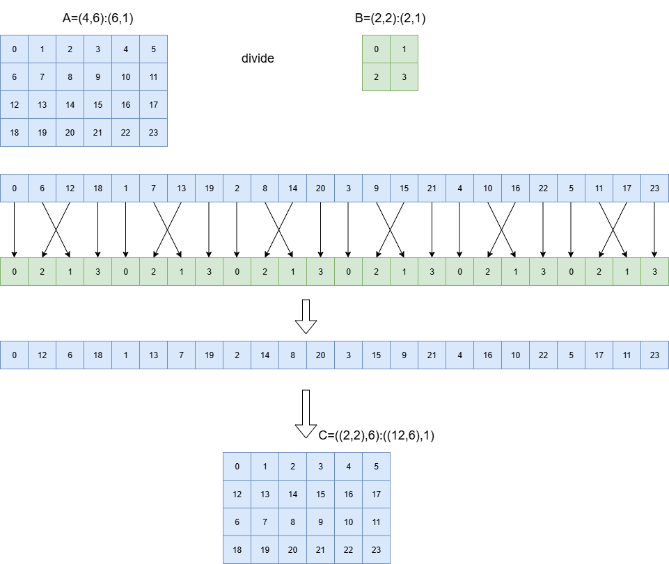

The above figure illustrates the result of `layout_divide`. Note that `Tensor C` is processed using `coalesce`. The following lists the result formats of all common operations:    
```
Layout Shape : (M, N, L, ...)
Tiler Shape  : <TileM, TileN>

logical_divide : ((TileM,RestM), (TileN,RestN), L, ...)
zipped_divide  : ((TileM,TileN), (RestM,RestN,L,...))
tiled_divide   : ((TileM,TileN), RestM, RestN, L, ...)
flat_divide    : (TileM, TileN, RestM, RestN, L, ...)
```

Finally, it is worth mentioning that there are also some fundamental operations: `inner_partition(Tensor, Tiler, Coord)` and `outer_partition(Tensor, Tiler, Coord)`. Specifically, `local_tile(Tensor, Tiler, Coord)` corresponds to the former, while `local_partition(Tensor, Layout, Idx)` corresponds to the latter. More details can be found in the [Partition a Tensor documentation](https://docs.nvidia.com/cutlass/media/docs/cpp/cute/03_tensor.html#partitioning-a-tensor). Here, only the result diagrams are provided.  

***local_tile(Tensor, Tiler, Coord)***           
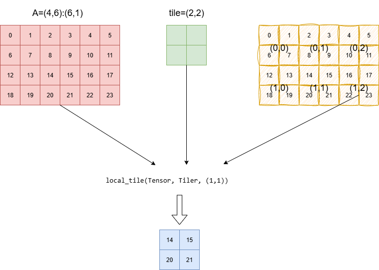    

***local_partition(Tensor, Layout, Idx)***             
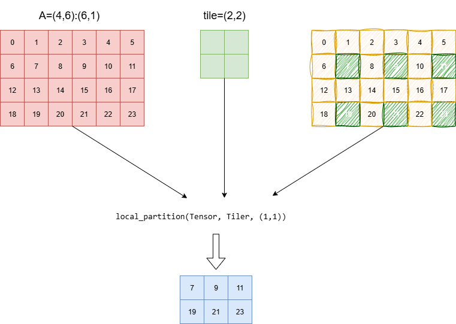    

In addition, for more information about tensor algorithms, refer to the [CuTe Tensor algorithms](https://docs.nvidia.com/cutlass/media/docs/cpp/cute/04_algorithms.html)

### Copy Abstract
The copy abstraction is a core component, including `cute::copy()`, `CopyOperation`, `Copy_Traits`, `Copy_Atom`, `TiledCopy`, and `ThrCopy`. We will introduce each of these constructs in detail.    

#### cute::copy()
`cute::copy()` is the top-level universal interface for performing data load and store operations. It is worth noting that moving a tile of data from the source address to the destination address typically requires repeated execution of the `Copy_Atom` operation. The following code snippet from *cute/algorithm/copy.hpp* demonstrates this:  
```
template <class... CopyArgs,
          class SrcEngine, class SrcLayout,
          class DstEngine, class DstLayout>
CUTE_HOST_DEVICE
void
copy(Copy_Atom<CopyArgs...>       const& copy_atom,
     Tensor<SrcEngine, SrcLayout> const& src,       // (V,Rest...)
     Tensor<DstEngine, DstLayout>      & dst)       // (V,Rest...)
{
  if constexpr (SrcLayout::rank == 1) {   // Dispatch the copy
    copy_atom.call(src, dst);
  } else {                                // Loop over all but the first mode
    constexpr int R = SrcLayout::rank;
    Tensor src_v = group_modes<1,R>(src);
    Tensor dst_v = group_modes<1,R>(dst);

    if constexpr (is_static<decltype(shape(src_v))>::value && is_static<decltype(shape(dst_v))>::value) {
      CUTE_STATIC_ASSERT_V(size<1>(src_v) == size<1>(dst_v));

      // AutoFilter on the Rest-mode
      auto dst_null = nullspace(layout<1>(dst_v));

      Tensor dst_n = zipped_divide(dst_v, make_tile(shape<0>(dst_v), dst_null));  // ((V, NLL), (_1, Rest))
      Tensor src_n = zipped_divide(src_v, make_tile(shape<0>(src_v), dst_null));  // ((V, NLL), (_1, Rest))

      CUTE_STATIC_ASSERT_V(size<1>(src_n) == size<1>(dst_n));
      CUTE_STATIC_ASSERT_V((cosize<0,1>(dst_n.layout()) == Int<1>{}), "Nullspace definition error");
      CUTE_STATIC_ASSERT_V((cosize<0,1>(src_n.layout()) == Int<1>{}), "Error: Ambiguous scatter detected in copy");
      CUTE_STATIC_ASSERT_V((size<1,0>(dst_n) == Int<1>{}));
      CUTE_STATIC_ASSERT_V((size<1,0>(src_n) == Int<1>{}));

      Tensor dst_c = dst_n(make_coord(_,Int<0>{}),make_coord(Int<0>{},_));        // (V, Rest)
      Tensor src_c = src_n(make_coord(_,Int<0>{}),make_coord(Int<0>{},_));        // (V, Rest)

      CUTE_STATIC_ASSERT_V( size<1>(src_c) ==  size<1>(dst_c));
      CUTE_STATIC_ASSERT_V(shape<0>(dst_c) == shape<0>(dst));
      CUTE_STATIC_ASSERT_V(shape<0>(src_c) == shape<0>(src));

      CUTE_UNROLL
      for (int i = 0; i < size<1>(dst_c); ++i) {
        copy_atom.call(src_c(_,i), dst_c(_,i));
      }
    } else {
      CUTE_UNROLL
      for (int i = 0; i < size<1>(dst_v); ++i) {
        copy_atom.call(src_v(_,i), dst_v(_,i));
      }
    }
  }
}
```
The for loop indicates that the data of a tile in a CTA generally needs to be copied repeatedly, even though we only call `cute::copy()` once within the kernel.

#### CopyOperation
After introducing `cute::copy`, we should discuss `Copy_Atom`. However, we will first explain `CopyOperation`, since it is the core component of `Copy_Atom` and should be introduced before. `CopyOperation` is essentially the execution instruction for `Copy_Atom`, encapsulating the relevant PTX instructions. For example, as shown in the following example from *cute/arch/copy_sm100_tma.hpp*:
```
struct SM100_TMA_2SM_LOAD_MULTICAST_2D
{
  CUTE_HOST_DEVICE static void
  copy(void const* desc_ptr, uint64_t* mbar_ptr, uint16_t multicast_mask, uint64_t cache_hint,
       void      * smem_ptr,
       int32_t const& crd0, int32_t const& crd1)
  {
#if defined(CUTE_ARCH_TMA_SM100_ENABLED)
    uint64_t gmem_int_desc = reinterpret_cast<uint64_t>(desc_ptr);
    // Executed by both CTAs. Set peer bit to 0 so that the
    // transaction bytes will update CTA0's barrier.
    uint32_t smem_int_mbar = cast_smem_ptr_to_uint(mbar_ptr) & Sm100MmaPeerBitMask;
    uint32_t smem_int_ptr  = cast_smem_ptr_to_uint(smem_ptr);
    asm volatile (
      "cp.async.bulk.tensor.2d.cta_group::2.shared::cluster.global.mbarrier::complete_tx::bytes.multicast::cluster.L2::cache_hint"
      " [%0], [%1, {%4, %5}], [%2], %3, %6;"
      :
      : "r"(smem_int_ptr), "l"(gmem_int_desc), "r"(smem_int_mbar), "h"(multicast_mask),
        "r"(crd0), "r"(crd1), "l"(cache_hint)
      : "memory");
#else
    CUTE_INVALID_CONTROL_PATH("Trying to use tma without CUTE_ARCH_TMA_SM100_ENABLED.");
#endif
  }
};
```

#### Copy_Traits
Next, we also see another core component of `Copy_Atom`, which is `Copy_Traits`. `Copy_Traits` can be seen as providing more detailed and essential information to `Copy_Atom`, but this information does not need to be managed by users. It includes the TMA descriptor `TmaDescriptor`, other auxiliary parameters, and necessary method functions. The details are omitted here for brevity. It is recommended to read various files related to `Copy_Traits`, such as *cute/atom/copy_traits_sm100_tma.hpp* and others.    

#### Copy_Atom
`Copy_Atom` is a basic atomic operation that can be executed by one or multiple threads within a warp. Typically, only one thread is responsible for the `TMA` operation. It serves as the implementation entry point for the copy operation. The relevant code can be found in *cute/atom/copy_atom.hpp*.

#### TiledCopy
`TiledCopy` encapsulates one or multiple `Copy_Atom` operations, describing how a tile of data in a CTA is organized by `Copy_Atom` operations. Its shape can be simply understood as having two modes: one represents the data layout for a single `Copy_Atom`, and the other indicates the number of repetitions. It provides methods to allocate a tile of data in a CTA to each thread shape, but these methods are not exposed to users here. The relevant code can be found in *cute/atom/copy_atom.hpp*. 

#### ThrCopy
`ThrCopy` is the thread-level operation, indicating how to map each thread's register fragment data to the tiled data of a CTA. It provides the user interface to partition a tile of data to a single thread. For example:
```
template <class STensor>
CUTE_HOST_DEVICE
auto
partition_S(STensor&& stensor) const {
  //static_assert(sizeof(typename remove_cvref_t<STensor>::value_type) == sizeof(typename TiledCopy::ValType),
  //              "Expected ValType for tiling SrcTensor.");
  auto thr_tensor = make_tensor(static_cast<STensor&&>(stensor).data(), TiledCopy::tidfrg_S(stensor.layout()));
  return thr_tensor(thr_idx_, _, repeat<rank_v<STensor>>(_));
}

template <class DTensor>
CUTE_HOST_DEVICE
auto
partition_D(DTensor&& dtensor) const {
  //static_assert(sizeof(typename remove_cvref_t<DTensor>::value_type) == sizeof(typename TiledCopy::ValType),
  //              "Expected ValType for tiling DstTensor.");
  auto thr_tensor = make_tensor(static_cast<DTensor&&>(dtensor).data(), TiledCopy::tidfrg_D(dtensor.layout()));
  return thr_tensor(thr_idx_, _, repeat<rank_v<DTensor>>(_));
}
```
Notice that `partition_S` is used for the source address, while `partition_D` is used for the destination address.

### MMA Abstract
In this section, we will focus on another core concept in CUTE: the MMA abstraction. It includes the following components: `cute::gemm()`, `MMAOperation`, `MMA_Traits`, `MMA_Atom`, `TiledMMA`, and `ThrMMA`.

#### cute::gemm()
`cute::gemm()` is the top-level universal interface for performing matrix multiplication and addition operations. However, it differs from `cute::copy()`, which requires users to write a for loop. For example:
```
template<typename Atom, typename TA, typename TB, typename TC>
CUTE_DEVICE void 
gemm_reset_zero_acc(Atom& atom, TA const& tA, TB const& tB, TC&& tC) 
{
  constexpr int rA = decltype(rank(tA))::value;
  constexpr int rB = decltype(rank(tB))::value;
  constexpr int rC = decltype(rank(tC))::value;
  static_assert(rA == 3 && rB == 3 && rC == 3);

  CUTLASS_PRAGMA_UNROLL
  for (int k_block = 0; k_block < size<2>(tA); k_block++)
  {
    cute::gemm(atom, tA(_,_,k_block), tB(_,_,k_block), tC);
    atom.accumulate_ = decltype(atom.accumulate_)::One;
  }
}
```
Note that whether to continue accumulating the output `Tensor C` is determined by the user by setting the `atom.accumulate_` flag: a value of one indicates continuous accumulation, while zero indicates a reset. Typically, accumulation is performed along the K-dimension to improve the L2-cache hit rate of TMA loads from global memory.

#### MMAOperation
`MMAOperation` is a practical execution instruction that describes how to perform matrix multiplication and addition operations.
```
template <class a_type, class b_type, class c_type,
          int M, int N, UMMA::Major a_major, UMMA::Major b_major,
          UMMA::ScaleIn a_neg = UMMA::ScaleIn::One, UMMA::ScaleIn b_neg = UMMA::ScaleIn::One>
struct SM100_MMA_F16BF16_SS
{
  static_assert(M == 64 || M == 128, "SM100_MMA_F16BF16 M-mode size should be 64 or 128 for 1 CTA cluster MMA.");
  static_assert((M == 64  && (N % 8 == 0)  && (8 <= N)  && (N <= 256)) ||
                (M == 128 && (N % 16 == 0) && (16 <= N) && (N <= 256)),
                "SM100_MMA_F16BF16 N-mode size should be a multiple of 8 between 8 and 256 for M=64,\
                 or a multiple of 16 between 16 and 256 for M=128.");

  using DRegisters = void;
  using ARegisters = uint64_t[1];
  using BRegisters = uint64_t[1];
  using CRegisters = uint32_t[1];

  CUTE_HOST_DEVICE static void
  fma(uint64_t const& desc_a,
      uint64_t const& desc_b,
      uint32_t const& tmem_c,
      uint32_t const& scaleC,
      uint64_t const& idescE)
  {
#if defined(CUTE_ARCH_TCGEN05_F16F32_MMA_ENABLED)
    if (cute::elect_one_sync()) {
      uint32_t mask[4] = {0, 0, 0, 0};
      asm volatile(
        "{\n\t"
        ".reg .pred p;\n\t"
        "setp.ne.b32 p, %4, 0;\n\t"
        "tcgen05.mma.cta_group::1.kind::f16 [%0], %1, %2, %3, {%5, %6, %7, %8}, p; \n\t"
        "}\n"
        :
        : "r"(tmem_c), "l"(desc_a), "l"(desc_b), "r"(uint32_t(idescE>>32)), "r"(scaleC),
          "r"(mask[0]), "r"(mask[1]), "r"(mask[2]), "r"(mask[3]));
    }
#else
    CUTE_INVALID_CONTROL_PATH("Attempting to use SM100_MMA_F16BF16_SS without CUTE_ARCH_MMA_SM100A_ENABLED");
#endif
  }
};
```
Finally, a brief note on the anatomy of the atom name.  `SM100_MMA_F16BF16_SS` can be deconstructed into the following parts.

`SM100_MMA`: specifies the instruction. Simply, the UMMA instruction for sm100.   
`F16BF16`: specifies the accepted input types for A and B. In this case, either fp16 or bf16. Note that this maps onto the `.kind` qualifier for `tcgen05.mma` (e.g., `.kind::f16`), while the exact input type is recorded by the [instruction descriptor](https://docs.nvidia.com/cuda/parallel-thread-execution/#tcgen05-instuction-desc-kind-tf32-f16-f8f6f4).    
`SS`: specifies memory location for A and B. `SS` is for both being in SMEM, while `TS` is for A being in TMEM and B in SMEM.   
Suffix: There are additional suffixes for more complex cases, such as block scaling or 2-SM UMMA.

#### MMA_Traits
`MMA_Traits` also provides essential details required for the `MMA_Atom` operation, although users do not need to manage this information directly. In particular, layout information is so important that it must be specified separately. For example:
```
//////////////////////////////////////////////////
// Common layouts for UMMA Shared Memory //
//////////////////////////////////////////////////

using cute::GMMA::Layout_MN_INTER_Atom;
using cute::GMMA::Layout_MN_SW32_Atom;
using cute::GMMA::Layout_MN_SW64_Atom;
using cute::GMMA::Layout_MN_SW128_Atom;
using cute::GMMA::Layout_K_INTER_Atom;
using cute::GMMA::Layout_K_SW32_Atom;
using cute::GMMA::Layout_K_SW64_Atom;
using cute::GMMA::Layout_K_SW128_Atom;

using Layout_MN_SW128_32B_Atom_Bits = ComposedLayout<Swizzle<2,5,2>, smem_ptr_flag, Layout<Shape< _1024,_4>,Stride<_1, _1024>>>;

template <class Type>
using Layout_MN_SW128_32B_Atom = decltype(upcast<sizeof_bits<Type>::value>(Layout_MN_SW128_32B_Atom_Bits{}));
```
```
///////////////////////////////////////////
// Common layouts for GMMA Shared Memory //
///////////////////////////////////////////

// M|N-major GMMA layouts in units of bits
using Layout_MN_INTER_Atom_Bits = ComposedLayout<Swizzle<0,4,3>, smem_ptr_flag, Layout<Shape< _128,_8>,Stride<_1, _128>>>;
using Layout_MN_SW32_Atom_Bits  = ComposedLayout<Swizzle<1,4,3>, smem_ptr_flag, Layout<Shape< _256,_8>,Stride<_1, _256>>>;
using Layout_MN_SW64_Atom_Bits  = ComposedLayout<Swizzle<2,4,3>, smem_ptr_flag, Layout<Shape< _512,_8>,Stride<_1, _512>>>;
using Layout_MN_SW128_Atom_Bits = ComposedLayout<Swizzle<3,4,3>, smem_ptr_flag, Layout<Shape<_1024,_8>,Stride<_1,_1024>>>;

// K-major GMMA layouts in units of bits
using Layout_K_INTER_Atom_Bits  = ComposedLayout<Swizzle<0,4,3>, smem_ptr_flag, Layout<Shape<_8, _128>,Stride< _128,_1>>>;
using Layout_K_SW32_Atom_Bits   = ComposedLayout<Swizzle<1,4,3>, smem_ptr_flag, Layout<Shape<_8, _256>,Stride< _256,_1>>>;
using Layout_K_SW64_Atom_Bits   = ComposedLayout<Swizzle<2,4,3>, smem_ptr_flag, Layout<Shape<_8, _512>,Stride< _512,_1>>>;
using Layout_K_SW128_Atom_Bits  = ComposedLayout<Swizzle<3,4,3>, smem_ptr_flag, Layout<Shape<_8,_1024>,Stride<_1024,_1>>>;

// M|N-major layouts in units of Type
template <class Type>
using Layout_MN_INTER_Atom = decltype(upcast<sizeof_bits<Type>::value>(Layout_MN_INTER_Atom_Bits{}));
template <class Type>
using Layout_MN_SW32_Atom  = decltype(upcast<sizeof_bits<Type>::value>(Layout_MN_SW32_Atom_Bits{}));
template <class Type>
using Layout_MN_SW64_Atom  = decltype(upcast<sizeof_bits<Type>::value>(Layout_MN_SW64_Atom_Bits{}));
template <class Type>
using Layout_MN_SW128_Atom = decltype(upcast<sizeof_bits<Type>::value>(Layout_MN_SW128_Atom_Bits{}));

// K-major layouts in units of Type
template <class Type>
using Layout_K_INTER_Atom = decltype(upcast<sizeof_bits<Type>::value>(Layout_K_INTER_Atom_Bits{}));
template <class Type>
using Layout_K_SW32_Atom  = decltype(upcast<sizeof_bits<Type>::value>(Layout_K_SW32_Atom_Bits{}));
template <class Type>
using Layout_K_SW64_Atom  = decltype(upcast<sizeof_bits<Type>::value>(Layout_K_SW64_Atom_Bits{}));
template <class Type>
using Layout_K_SW128_Atom = decltype(upcast<sizeof_bits<Type>::value>(Layout_K_SW128_Atom_Bits{}));
```
The above code snippet shows that an atomic MMA operation must specify the data size. It also explains how the shared memory layout is organized for a single MMA_Atom operation. For further details, see *cute/atom/mma_traits_sm100.hpp* and *cute/atom/mma_traits_sm90_gmma.hpp*.

#### MMA_Atom
`MMA_Atom` is a basic MMA operation and provides three methods to adjust the shared memory layout so that it fits the MMA operation.
```
make_fragment_C(CTensor&& ctensor)

make_fragment_A(CTensor&& ctensor)

make_fragment_B(CTensor&& ctensor)
```

#### TiledMMA
`TiledMMA` describes how to organize a tile of data within a CTA to fit the MMA operation. It can be created using the following function:
```
template <class MMA_Op,
          class MMAThrLayout = Layout<Shape<_1,_1,_1>>,
          class Permutations = Tile<Underscore,Underscore,Underscore>>
CUTE_HOST_DEVICE constexpr
auto
make_tiled_mma(MMA_Atom<MMA_Op> const& mma_atom,
               MMAThrLayout     const& thr_layout   = {},
               Permutations     const& permutations = {})
{
  auto thr_layout_mnk  = append<3>(thr_layout, Layout<_1,_0>{});
  auto permutation_mnk = append<3>(permutations, _);

  return TiledMMA<MMA_Atom<MMA_Op>,
                  decltype(thr_layout_mnk),
                  decltype(permutation_mnk)>{mma_atom, thr_layout_mnk};
}
```
Except for `MMA_Atom`, we will next discuss `MMAThrLayout` and `Permutations`. `MMAThrLayout` specifies the thread layout along the M, N, and K dimensions for a single `MMA_Atom`. `Permutations` defines the arrangement of each dimension, ensuring that the output matrix can be accessed continuously by every thread. The following two comparative diagrams from the [official CUTE discussion](https://github.com/NVIDIA/cutlass/discussions/1345) help illustrate these concepts.

***Before permutation***
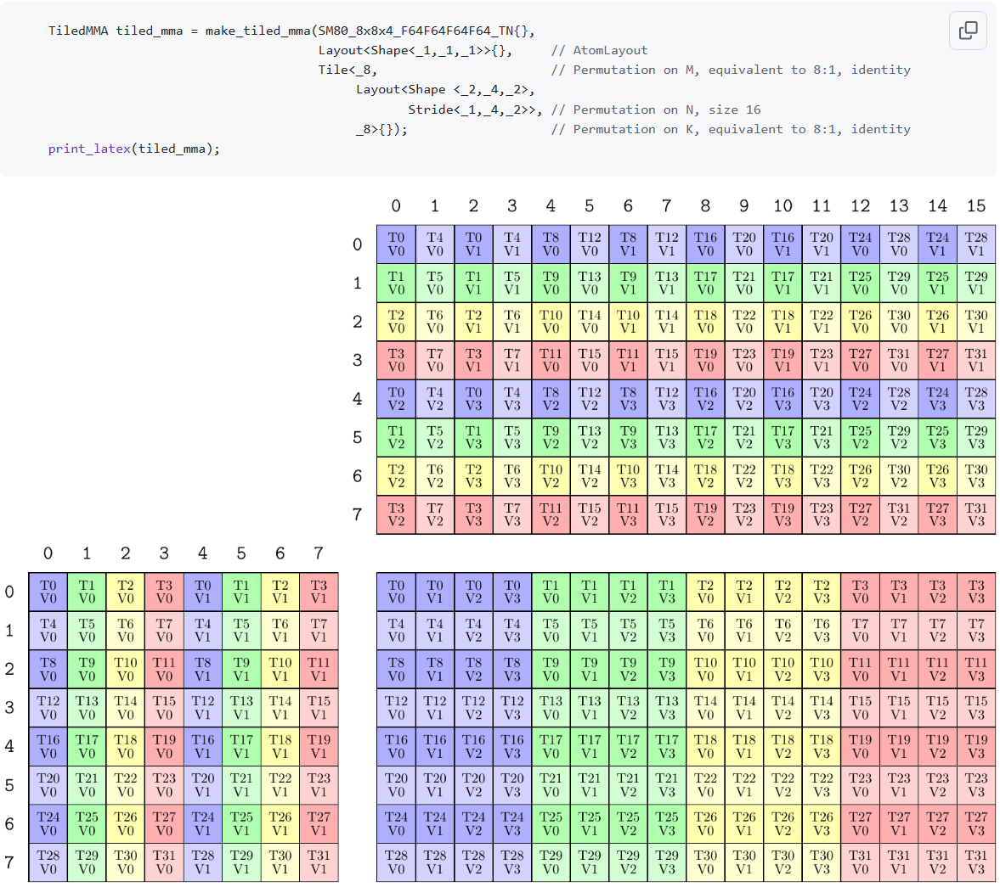

***After permutation***
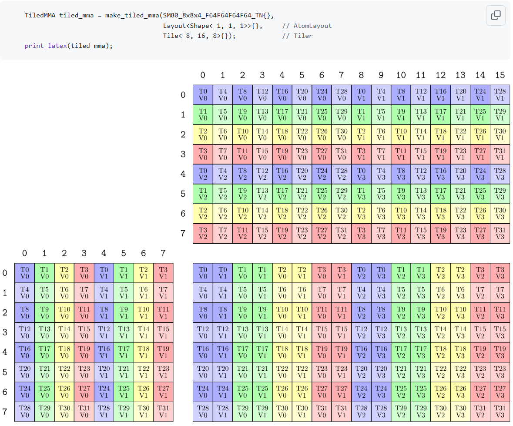

#### ThrMMA
`ThrMMA` indicates that each thread is responsible for a tile of MMA operation within a CTA. It also provides function interfaces for partitioning a memory tile to fit the MMA operation for each thread.
```
 template <class CTensor>
  CUTE_HOST_DEVICE constexpr
  auto
  partition_fragment_C(CTensor&& ctensor) const
  {
    return TiledMMA::make_fragment_C(partition_C(ctensor));
  }

  template <class ATensor>
  CUTE_HOST_DEVICE constexpr
  auto
  partition_fragment_A(ATensor&& atensor) const
  {
    return TiledMMA::make_fragment_A(partition_A(atensor));
  }

  template <class BTensor>
  CUTE_HOST_DEVICE constexpr
  auto
  partition_fragment_B(BTensor&& btensor) const
  {
    return TiledMMA::make_fragment_B(partition_B(btensor));
  }
```

### Swizzle
In the final section, we will talk about a necessary operation: `swizzle`. Throughout CUTE, there are two types of `swizzle` operations: one for SMEM and another for thread blocks. We focus on the former. The latter is briefly introduced due to the limited documentation, which prevents a detailed explanation.

#### SMEM Swizzle
It is acknowledged that SMEM has 32 banks, each storing 32-bit units. This design allows all 32 banks to be accessed by 32 threads (a warp) simultaneously. However, if multiple threads access different addresses within the same bank, this leads to poor performance known as bank conflict. To address this, CUTE introduces the `swizzle` operation, which can be described by the following formula.   

$$
offest_{bank\_conflict\_free}=Swizzle(Layout(Corrd))
$$

Two documents are recommended for further reading: [Swizzle Models](https://docs.nvidia.com/cuda/parallel-thread-execution/#tensor-swizzling-modes) and [Shared Memory Layout and Swizzling](https://docs.nvidia.com/cuda/parallel-thread-execution/index.html#tcgen05-shared-memory-layout-swizzling).

For instance, consider the following code snippet:
```
swizzle<B, M, S>(offset)
```

A brief note on the parameters of the above code snippet:

`B`: specifies the number of rows, which is $2^B$.  
`M`: specifies the number of basic elements, which is $2^M$.  
`S`: specifies the number of columns, which is $2^S$.    

This can be explained by the example `swizzle(1,1,2)`, as shown in the graph below.

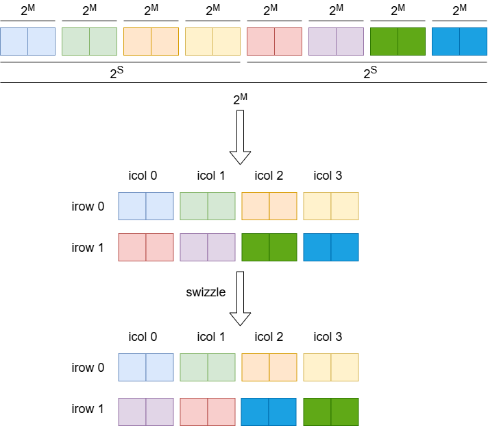

The above figure shows that `Swizzle` rearranges the data based on $2^M$ elements. This can be explained by the following formula:

$$
Swizzle(Coord(irow,icol))=(irow,irow \oplus icol)
$$

Notice that the `XOR` operation is bijective, meaning each input produces a unique output and can be reversed.

However, how do we select appropriate `Swizzle` parameters? Actually, the recommended documents explain this. For example, the following picture from the NVIDIA documentation illustrates the selection:

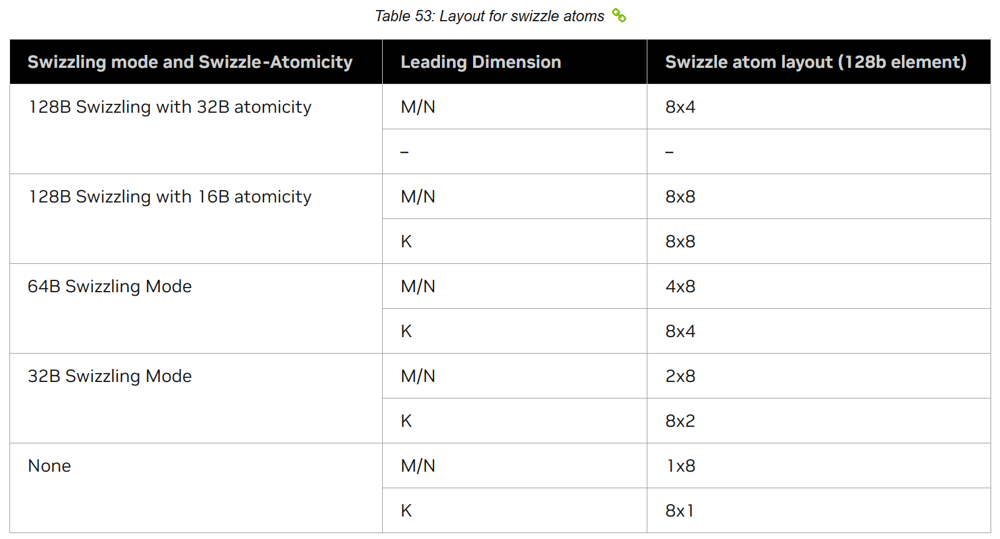

The above shapes are for elements of size 128 bits. For smaller element sizes, the same shapes would get multiplied along the leading dimension by a factor of `128 / sizeof_bits(Element)`. For example, 128B MN major with 16B atomicity swizzle atom would have a shape of `(8*(128/32))x8 = 32x8` for tf32 tensor core inputs.

Finally, let's look at an example to thoroughly understand how `Swizzle` addresses bank conflicts. There is a composed layout of SMEM.
```
cute::ComposedLayout<
      cute::Swizzle<3, 4, 3>, 
      cute::smem_ptr_flag_bits<16>, 
      cute::Layout<cute::tuple<cute::tuple<cute::C<128>, cute::C<16>>, cute::_1, cute::tuple<cute::_4, cute::_2>, cute::_2>, cute::tuple<cute::tuple<cute::_64, cute::_1>, cute::_0, cute::tuple<cute::C<16>, cute::C<8192>>, cute::_16384>>
      >
```

Next, we consider an atom with `shape(128,16)` and keep the K-major leading dimension.
```
cute::ComposedLayout<
      cute::Swizzle<3, 4, 3>, 
      cute::smem_ptr_flag_bits<16>, 
      cute::Layout<cute::tuple<cute::C<128>, cute::C<16>>, cute::tuple<cute::_64, cute::_1>>
      >
```

Obviously, after the `Swizzle` operation, the shape of SMEM is `(8,8)` with base units of 16 elements, each 16 bits. This means that 8 elements will be addressed by a thread, corresponding to 32 bytes. For a warp, the total addressed size is 1024 bytes, which is the maximum size a warp can address.

Next, we will explain this in detail using the graph below. To aid understanding, we adjust the original layout shape `(128, 16)` so that the number of columns matches the number of banks. Meanwhile, the smallest unit size is 32 bits instead of 16 bits, as shown below.

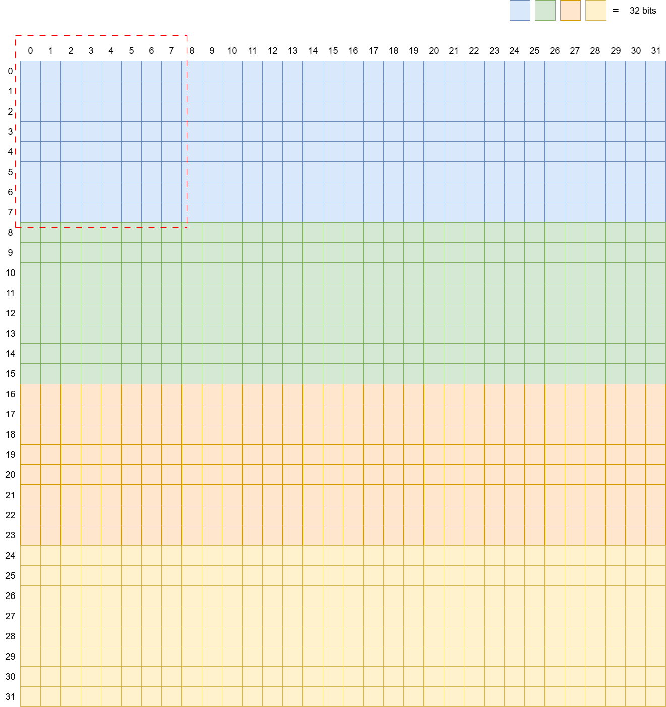

The region surrounded by the red dashed line is addressed by 32 threads (a warp), with each thread handling 8 elements. This results in serious bank conflicts, specifically a 24-way conflict. To resolve this, we use `Swizzle<3, 4, 3>` to adjust the SMEM layout to a shape of `(8,8)`, where each unit is 128 bits (16 bytes), as shown below.

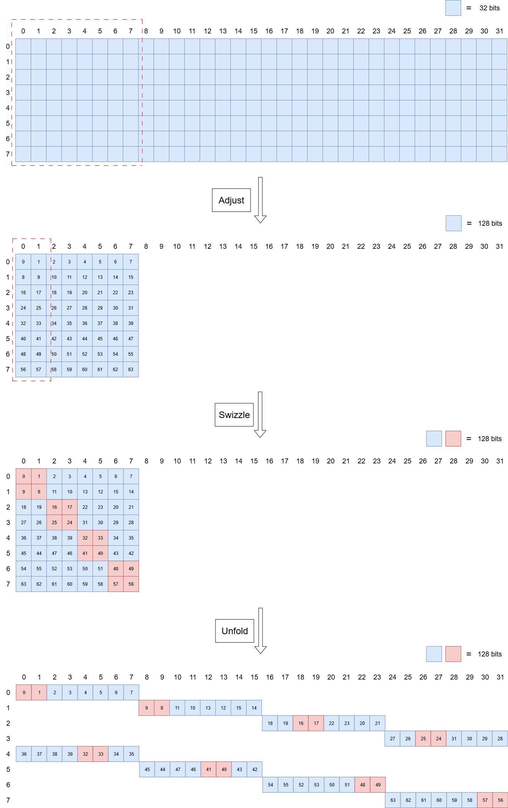

The above figure provides a detailed depiction of the `Swizzle` process, so no further details are provided here. For further information, refer to [Swizzle Models](https://docs.nvidia.com/cuda/parallel-thread-execution/#tensor-swizzling-modes) and [Shared Memory Layout and Swizzling](https://docs.nvidia.com/cuda/parallel-thread-execution/index.html#tcgen05-shared-memory-layout-swizzling).

#### Thread Block Swizzle
`Thread Block Swizzle` is used by CTAs to improve L2 cache efficiency when accessing global memory. More details will be added in the future.

## Overview
Actually, a kernel can be simply divided into three sections: memory access, computation, and pipeline. The first two are basically provided by CUTE, while the latter needs to be implemented by users. The so-called pipeline refers to how we organize the order of memory access and computation to maximize their overlap. However, since memory is limited, there is always a tradeoff between memory access and computation.    

Next, we will introduce the Collective Layer in detail. It mainly consists of two sections: the mainloop and the epilogue. The mainloop generally handles GEMM operations, while the epilogue quantizes the results. However, FMHA is different in that all its operations are placed in the mainloop section. Its epilogue simply stores the results from SMEM to global memory using TMA. Therefore, we will focus on the mainloop section and briefly mention the epilogue section. Before that, an overview diagram of the mainloop pipeline is provided below.

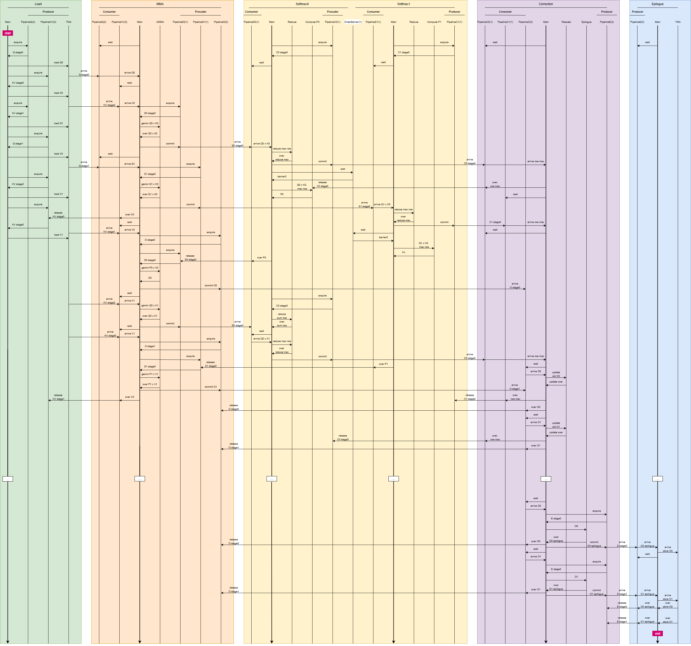

## Mainloop
This section provides a concrete implementation of each conditional branch within the Kernel Layer. Accordingly, the Mainloop is divided into four parts: Load, MMA, Softmax, and Correction. Next, we will explain each part in detail, including code implementation. However, before introducing these components, we need to review a prologue that includes some essential variable type declarations.

### Prologue
This section introduces the main variable types used in the mainloop—MMA, SMEM, TMEM, and pipeline—and explains the rationale behind their specific parameter settings and configurations in the FMHA kernel.    

**MMA**   
We need two MMA class types within the Collective Layer provided by Cutlass because we need to execute two GEMM operations: $Q * K^{T}$ and $P * V$. The code snippets are as follows:
```
using CollectiveMmaQK = typename cutlass::gemm::collective::CollectiveBuilder<
    cutlass::arch::Sm100, cutlass::arch::OpClassTensorOp,
    Element, StrideQ, Alignment,
    Element, StrideK, Alignment,
    ElementQK,
    TileShapeQK, ClusterShape, cutlass::gemm::collective::StageCount<3> /* we change it later anyways*/,
    cutlass::gemm::KernelTmaWarpSpecialized1SmSm100>::CollectiveOp;
```
```
using CollectiveMmaPV = typename cutlass::gemm::collective::CollectiveBuilder<
  cutlass::arch::Sm100, cutlass::arch::OpClassTensorOp,
  // the stride for A does not matter since we do not load from smem at all
  Element, StrideK, Alignment,
  Element, decltype(select<1,0,2>(StrideV{})), Alignment,
  ElementPV,
  TileShapePV, ClusterShape, cutlass::gemm::collective::StageCount<3> /* we change it later anyways*/,
  cutlass::gemm::KernelTmaWarpSpecialized1SmSm100>::CollectiveOp;
```
Note that `CollectiveMmaPV` does not require the A matrix and needs the B matrix to be in MN-major format. This is because the result of `CollectiveMmaQK` is MN-major and will be stored in TMEM instead of SMEM. Therefore, the stride of the B matrix in `CollectiveMmaPV` needs to be reordered accordingly.    

**SMEM**    
The main goal of this section is to introduce the layout of SMEM. In fact, the layout is already provided by `CollectiveMmaQK` and `CollectiveMmaPV`. However, we need to adjust the stage dimension so that it is a value instead of a tuple, as follows:
```
using SmemLayoutQ = decltype(unstageSmemLayout(typename CollectiveMmaQK::SmemLayoutA{}, Int<StageCountQ>{}));
```
```
template<class Layout, class Stages = _1>
CUTE_DEVICE 
constexpr auto 
unstageSmemLayout(Layout const& layout, Stages stages = {}) 
{
    return composition(layout, prepend<decltype(rank(layout))::value>(make_layout(stages), _));
}
```
Note that `prepend<decltype(rank(layout))::value>(make_layout(stages), _)` allows `composition` to adjust only the stage dimension while keeping other dimensions unchanged. It is recommended to further explore the underlying code implementation for more details.

Next, we also need to define the following variable types to enable the Device Layer to allocate the required SMEM size.
```
struct TensorStorage
{
  cute::array_aligned<Element, cute::cosize_v<SmemLayoutQ>> smem_q;
  union {
    cute::array_aligned<Element, cute::cosize_v<SmemLayoutK>> smem_k;
    cute::array_aligned<Element, cute::cosize_v<SmemLayoutV>> smem_v;
  };
};
```

**TMEM**    
In the previous section, TMEM was introduced in detail. It is known that the initial address of TMEM is stored in SMEM. However, how to partition the internal regions of TMEM is not discussed. In practice, users need to manually divide TMEM and record the starting address of each region.
```
enum class TmemAllocation : uint32_t 
{
  kSizeS = 128,
  kSizeO = 128,
  kSizeP = 32,
  S0 = 0,
  S1 = S0 + kSizeS,
  V0 = S0,  // stats storage from softmax to correction
  V1 = S1,
  P0 = S0 + kSizeP,
  P1 = S1 + kSizeP,
  O0 = S1 + kSizeS,
  O1 = O0 + kSizeO,
  kEnd = O1 + kSizeO
};
```

**Pipeline**
We introcude the initialization of pipeline in Kernel Layer instead  introduce its types of variables. Now, we will give the example as follows:
```
// from load to mma warp, protects q in smem
using PipelineQ = cutlass::PipelineTmaUmmaAsync<
  StageCountQ,
  typename CollectiveMmaQK::AtomThrShapeMNK
>;

// from load to mma warp, protects k/v in smem
using PipelineKV = cutlass::PipelineTmaUmmaAsync<
  StageCountKV,
  typename CollectiveMmaQK::AtomThrShapeMNK
>;

// from mma to softmax0/1 warp, protects S in tmem
// (not sure yet about the reverse direction)
// there is one pipe per softmax warp, and the mma warp alternates between them
using PipelineS = cutlass::PipelineUmmaAsync<1>;

// from softmax0/1/ to correction wg
using PipelineC = cutlass::PipelineAsync<1>;

// from mma to correction
using PipelineO = cutlass::PipelineUmmaAsync<2>;

// from corr to epilogue
using PipelineE = cutlass::PipelineAsync<2>;

using OrderBarrierSoftmax = cutlass::OrderedSequenceBarrier<
  /*stages*/ 1, /*groups*/ 2>;
```
Note that different pipeline stages use different types: `PipelineTmaUmmaAsync`, `PipelineUmmaAsync`, and `PipelineAsync`.

### Load
There are three global memory tensors (Q, K, V) that need to be loaded from global memory into SMEM. Instead of reintroducing the pipeline—which is already explained in detail in the Overview diagram and in the file *fmha_blackwell_sm120/sm120_fmha_load_tma_warpspecialized.hpp*—we will focus on how to determine the tile of data assigned to the current CTA.    

First, let's look at a code snippet that demonstrates how to determine the tile of data assigned to each CTA.
```
ThrMMA mma_qk = typename CollectiveMmaQK::TiledMma{}.get_slice(0);    // only one CTA in group if multicast is not used
Tensor mQ_qdl_p = params.tma_load_q.get_tma_tensor(select<0,2,3>(problem_shape));

// Offsets for variable length sequences are not handled yet, so they are temporarily ignored
int q_offs_0   = 0;
int q_offs_2_1 = 0;
Tensor mQ_qdl = domain_offset(make_coord(q_offs_0, _0{}, make_coord(_0{}, q_offs_2_1)), mQ_qdl_p);

Tensor gQ_qdl   = local_tile(mQ_qdl, TileShapeQK{}, make_coord(_, _, _), Step<_1, X, _1>{});
Tensor tSgQ_qdl = mma_qk.partition_A(gQ_qdl);
Tensor sQ       = make_tensor(make_smem_ptr(storage.smem_q.data()), SmemLayoutQ{});

auto [tQgQ_qdl, tQsQ] = tma_partition(
  params.tma_load_q, /*not use mulitcast*/ _0{}, /*not use mulitcast*/ make_layout(_1{}),
  group_modes<0,3>(sQ), group_modes<0,3>(tSgQ_qdl)
);

Tensor tQgQ = tQgQ_qdl(_, _, _0{}, get<2>(blk_coord_q));
```

Next, we will explain each step in detail. According to the code above, we first need to create a `TiledMMA` object, and then obtain a `ThrMMA` instance from it. For example:
```
ThrMMA mma_qk = typename CollectiveMmaQK::TiledMma{}.get_slice(0);    // only one CTA in group if multicast is not used
```

Note that the parameter for `get_slice(0)` is 0, which represents the current block or CTA rank in the cluster, rather than the thread ID of the current thread in the block. This is because multicast mode is not used here. If you want to use multicast, refer to the code snippet below or read this [TMA blog](https://research.colfax-intl.com/tutorial-hopper-tma/).
```
int lane_predicate = cute::elect_one_sync();

uint16_t mcast_mask_b = 0;

if (lane_predicate == 1) {
  if constexpr (cute::is_same_v<typename CollectiveMmaQK::GmemTiledCopyB, SM90_TMA_LOAD_MULTICAST>) {
    auto block_layout = Layout<ClusterShape>{}; // (m,n) -> block_id
    for (int m = 0; m < size<0>(block_layout); ++m) {
      mcast_mask_b |= (uint16_t(1) << block_layout(m,_0{},Int<0>{}));
    }
  }
}
```

Next, we obtain the complete matrix tensor layout by using the following code.
```
Tensor mQ_qdl_p = params.tma_load_q.get_tma_tensor(select<0,2,3>(problem_shape));
```

As shown in the code above, we only provide the tensor `Shape`. This is because when the `tma_load_q` template type is created, the `Stride` is already specified via template parameters. Note that `tma_load_q` is a `Copy Atom` introduced in the CUTE section. It is instantiated as shown in the code snippet below.
```
using TMA_A = decltype(make_tma_atom_A_sm100<TmaInternalElementA>(
    GmemTiledCopyA{},
    make_tensor(recast_ptr<TmaInternalElementA>(nullptr), repeat_like(StrideA{}, int32_t(0)), StrideA{}),
    SmemLayoutA{}(_,_,_,cute::Int<0>{}),
    TileShape{},
    TiledMma{},
    ClusterLayout_VMNK{})
  );
```

The implementation of `make_tma_atom_A_sm100` can be found in *cute/atom/copy_traits_sm100_tma.hpp* and *cute/atom/copy_traits_sm90_tma.hpp*. The code is straightforward and self-explanatory, so we do not provide further explanation here.

The code snippet below can be ignored because it is used for variable-length sequences, which are not considered in the current FMHA kernel. It is preserved for future expansion.
```
// Offsets for variable length sequences are not handled yet, so they are temporarily ignored
int q_offs_0   = 0;
int q_offs_2_1 = 0;
Tensor mQ_qdl = domain_offset(make_coord(q_offs_0, _0{}, make_coord(_0{}, q_offs_2_1)), mQ_qdl_p);
```

The following code snippet demonstrates how to determine the tile of data assigned to the current block. First, `local_tile` is used to partition the entire tensor in global memory into tiles of shape `TileShapeQK` for each block or CTA. Then, `partition_A` further divides the tile assigned to each CTA into fragments suitable for each thread, according to the `ThrMMA` mode.
```
Tensor gQ_qdl   = local_tile(mQ_qdl, TileShapeQK{}, make_coord(_, _, _), Step<_1, X, _1>{});
Tensor tSgQ_qdl = mma_qk.partition_A(gQ_qdl);
```

**result**
```
// gQ_qdl
cute::Tensor<cute::ViewEngine<cute::ArithmeticTupleIterator<cute::ArithmeticTuple<cute::C<0>, int, cute::C<0>, cute::C<0>, int>>>, cute::Layout<cute::tuple<cute::_128, cute::_128, int, int, cute::tuple<cute::tuple<int32_t, int32_t>, int>>, cute::tuple<cute::ScaledBasis<cute::C<1>, 1>, cute::ScaledBasis<cute::C<1>, 0>, cute::ScaledBasis<cute::C<128>, 1>, cute::ScaledBasis<cute::C<128>, 0>, cute::tuple<cute::tuple<cute::ScaledBasis<cute::C<1>, 2>, cute::ScaledBasis<cute::C<1>, 3>>, cute::ScaledBasis<cute::C<1>, 4>>>>>

// tSgQ_qdl
cute::Tensor<cute::ViewEngine<cute::ArithmeticTupleIterator<cute::ArithmeticTuple<cute::C<0>, int, cute::C<0>, cute::C<0>, int>>>, cute::Layout<cute::tuple<cute::tuple<cute::C<128>, cute::C<16>>, cute::_1, cute::_8, int, int, cute::tuple<cute::tuple<int32_t, int32_t>, int>>, cute::tuple<cute::tuple<cute::ScaledBasis<cute::C<1>, 1>, cute::ScaledBasis<cute::C<1>, 0>>, cute::C<0>, cute::ScaledBasis<cute::C<16>, 0>, cute::ScaledBasis<cute::C<128>, 1>, cute::ScaledBasis<cute::C<128>, 0>, cute::tuple<cute::tuple<cute::ScaledBasis<cute::C<1>, 2>, cute::ScaledBasis<cute::C<1>, 3>>, cute::ScaledBasis<cute::C<1>, 4>>>>>
```

Note that the usage of `local_tile` is explained in the CUTE section and will be omitted here. However, the parameter `Step<_1, X, _1>{}` deserves further discussion. It is used to project the K dimension, preventing `local_tile` from partitioning this dimension within the tile assigned to each CTA.

Additionally, some readers may be confused about why `local_tile` does not specifically handle **GQA**. How should **GQA** be managed in this case? In fact, no special handling is required, as the grouping is automatically managed due to the carefully designed `Stride` of the K/V tensors, as shown below:
```
stride_K = make_stride(H_K*D, _1{}, make_stride(make_stride(_0{}, D), H_K*D*SK));
stride_V = stride_K;
```

This indicates that the grouping dimension is 0, which is used by the `Layout` operation to determine the location.

After processing the data source, the data destination—shared memory (SMEM)—also needs to be handled. This can be achieved by simply creating a tensor with `SmemLayoutQ{}` and the SMEM address. Bank conflicts can be ignored, as `make_tensor` automatically resolves them through the `Swizzle` operation.
```
Tensor sQ = make_tensor(make_smem_ptr(storage.smem_q.data()), SmemLayoutQ{});
```

Using the methods described above, we can call `cute::copy()` to transfer data from global memory to shared memory (SMEM). However, further processing is required, as the data layout does not directly match the `MMA Atom`. Therefore, a corresponding `Copy Atom` must be created to align with the `MMA Atom`, as shown below:
```
auto [tQgQ_qdl, tQsQ] = tma_partition(
  params.tma_load_q, /*not use mulitcast*/ _0{}, /*not use mulitcast*/ make_layout(_1{}),
  group_modes<0,3>(sQ), group_modes<0,3>(tSgQ_qdl)
);
```

Note that the parameter `_0{}` represents the coordinates of the current CTA within the cluster, and `make_layout(_1{})` specifies the cluster `Layout`. Both are used for multicast operations.

Finally, we can locate the current CTA position in global memory, eg:
```
Tensor tQgQ = tQgQ_qdl(_, _, _0{}, get<2>(blk_coord_q));
```

Additionally, it is worth mentioning that the `Load` stage does not use registers, allowing the number of registers to be kept at the minimum value of 24. This returns surplus registers to the CTA's register pool, enabling other threads to utilize them.

## MMA
Updating ... ... ...
